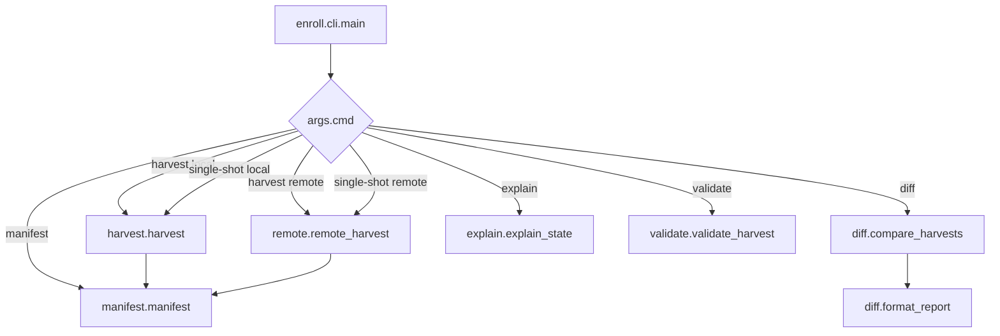
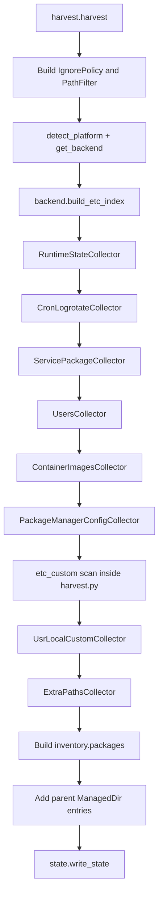
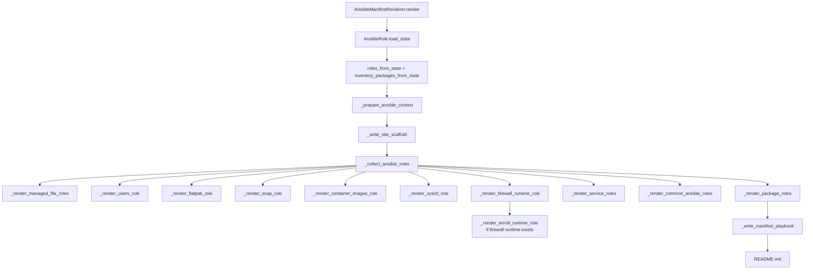
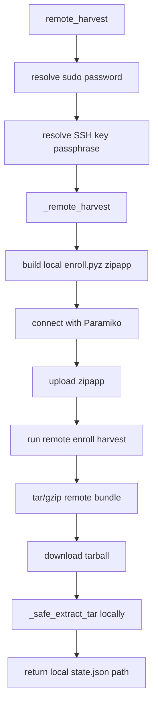

# Enroll Development Guide

Interested in the internals of Enroll?

This guide describes the current `enroll` codebase for maintainers. It focuses on how the project is organised, what calls what, how harvest state flows into generated configuration-management output, and which invariants matter when changing the code.

---

## 1. What Enroll does

`enroll` is a Linux host inspection and configuration-management generation tool.

Its core pipeline is:

```text
Running Linux host
  |
  | enroll harvest
  v
Harvest bundle
  state.json
  artifacts/<role>/<path-relative-to-root>
  |
  | enroll manifest
  v
Generated configuration-management output
  Ansible roles/playbook
```

The harvest bundle is deliberately target-neutral. Ansible renderer consumes the same `state.json` shape and the same harvested artifacts. Renderer code should translate harvest state into the target's idioms; it should not invent source facts that belong in the harvest.

`enroll diff` is also built around harvest bundles. It compares two harvests and reports drift between them:

```bash
enroll diff --old ./baseline --new ./current
```

---

## 2. Repository layout

The project is a single Python package under `enroll/` with tests under `tests/`.

```text
enroll/
  __main__.py                 python -m enroll entry point
  cli.py                      argparse CLI and subcommand dispatcher
  version.py                  package version lookup

  harvest.py                  top-level local harvest orchestration and runtime helpers
  harvest_types.py            dataclasses persisted into state.json
  harvest_collectors/         feature-specific collectors used by harvest.py
    context.py                HarvestContext and HarvestCollector base
    runtime.py                root-only runtime state collector wrapper
    cron_logrotate.py         cron/logrotate unification collector
    services.py               systemd service + manual package collector
    users.py                  users, SSH public files, Flatpak, Snap collector
    package_manager.py        apt/dnf/yum config collectors
    container_images.py       Docker/Podman image collector
    paths.py                  /usr/local and --include-path collectors

  manifest.py                 target router and SOPS manifest wrapper
  ansible.py                  Ansible renderer
  cm.py                       renderer-neutral CMModule model and grouping helpers
  role_names.py               reserved singleton role-name protection

  accounts.py                 users, SSH public files, Flatpak and Snap discovery
  platform.py                 OS/package-backend abstraction
  debian.py                   dpkg/apt helpers
  rpm.py                      rpm/dnf/yum helpers
  systemd.py                  systemctl wrappers and parsers
  system_paths.py             known config paths and filesystem scanners
  package_hints.py            service/package name and config attribution helpers

  capture.py                  safe file/symlink capture into artifacts/
  fsutil.py                   file md5 + owner/group/mode helpers, open_no_follow_path
  ignore.py                   secret/noise avoidance policy
  pathfilter.py               --include-path / --exclude-path matching and expansion
  state.py                    state.json load/write helpers
  yamlutil.py                 YAML helpers used by renderers/JinjaTurtle
  jinjaturtle.py              optional config-file templating integration

  harvest_safety.py           private output dirs, safe output parents, output path hardening
  manifest_safety.py          artifact-file safety, manifest output dirs, directory-bundle freezing
  render_safety.py            scaffold-token allowlist + !unsafe data wrapping for generated YAML

  diff.py                     harvest comparison and notifications
  explain.py                  human/JSON explanation of harvest contents
  validate.py                 schema and artifact consistency validation
  remote.py                   Paramiko remote harvest implementation
  cache.py                    secure local cache directories for harvests
  sopsutil.py                 SOPS binary encryption/decryption helpers
  schema/state.schema.json    JSON Schema for harvest state

tests/
  test_*.py                   unit tests grouped mostly by module/feature
```

The installed command is configured in `pyproject.toml`:

```toml
[tool.poetry.scripts]
enroll = "enroll.cli:main"
```

`python -m enroll` calls the same CLI through `enroll/__main__.py`.

---

## 3. Main runtime flows

### 3.1 CLI entry flow

All user-facing commands enter through `enroll.cli.main()`.

```text
enroll command
  -> enroll.cli.main()
     -> builds argparse parser and subparsers
     -> discovers optional INI config file
     -> injects config-derived argv defaults before user argv
     -> parses final argv
     -> dispatches by args.cmd
```

The supported subcommands are:

```text
harvest       collect a harvest bundle from a local or remote host
manifest      generate Ansible output from a harvest bundle
single-shot   run harvest and manifest in one command
diff          compare two harvest bundles and report drift
explain       produce a human/JSON explanation of a harvest
validate      validate state.json and referenced artifacts
```

`cli.py` should stay orchestration-heavy, not domain-heavy. It should parse flags, handle config/SOPS/remote branching, and then call the relevant module. It should not contain the meaning of a service, package, user, file, renderer resource, or harvest snapshot.

### 3.2 Subcommand call graph



Important dependency direction:

```text
cli.py
  depends on harvest.py, manifest.py, diff.py, explain.py, validate.py, remote.py

harvest.py
  depends on harvest_collectors, platform backends, capture policy, system scanners

manifest.py
  depends on ansible.py

ansible.py
  depends on state.py, cm.py, harvested artifacts, and helpers
```

---

## 4. Harvest bundles

A plaintext harvest bundle is a directory:

```text
<bundle>/
  state.json
  artifacts/
    <role_name>/
      etc/...
      usr/local/...
      sysctl/...
      firewall/...
```

`state.json` is written by `enroll.state.write_state()` and loaded by `enroll.state.load_state()`.

The renderer relies on this invariant:

```text
state.json roles.*.managed_files[*].src_rel
  must correspond to
artifacts/<artifact_role>/<src_rel>
```

For example, a captured `/etc/nginx/nginx.conf` in role `nginx` normally becomes:

```json
{
  "path": "/etc/nginx/nginx.conf",
  "src_rel": "etc/nginx/nginx.conf",
  "owner": "root",
  "group": "root",
  "mode": "0644",
  "reason": "modified_conffile"
}
```

and the artifact is copied to:

```text
artifacts/nginx/etc/nginx/nginx.conf
```

Renderer role/module names can differ from artifact roles, especially when common grouping is enabled. Copy helpers must therefore pass the original artifact role, not blindly use the generated renderer module name.

---

## 5. `state.json` shape and snapshot dataclasses

The top-level state assembled by `harvest.harvest()` is:

```json
{
  "enroll": {
    "version": "...",
    "harvest_time": 123456789
  },
  "host": {
    "hostname": "...",
    "os": "debian|redhat|unknown",
    "pkg_backend": "dpkg|rpm|unknown",
    "os_release": {}
  },
  "inventory": {
    "packages": {}
  },
  "roles": {
    "users": {},
    "flatpak": {},
    "snap": {},
    "container_images": {},
    "services": [],
    "packages": [],
    "apt_config": {},
    "dnf_config": {},
    "firewall_runtime": {},
    "sysctl": {},
    "etc_custom": {},
    "usr_local_custom": {},
    "extra_paths": {}
  }
}
```

The persisted in-memory shapes live in `enroll/harvest_types.py`.

| Dataclass | Purpose |
|---|---|
| `ManagedFile` | A file to recreate, with destination path, artifact path, owner, group, mode, and reason. |
| `ManagedLink` | A symlink to recreate, such as `sites-enabled` entries. |
| `ManagedDir` | A directory to ensure exists, with owner/group/mode. |
| `ExcludedFile` | A path that was considered but skipped, with a reason. |
| `ServiceSnapshot` | One enabled systemd service and its packages/config/state. |
| `PackageSnapshot` | One manual package and related config. `has_config=False` is used when the package should still be installed but no config was found. |
| `UsersSnapshot` | Human users, groups, managed SSH/dotfiles, and per-user Flatpak data. |
| `FlatpakSnapshot` | System Flatpaks and system Flatpak remotes. |
| `SnapSnapshot` | System Snap installs. |
| `ContainerImagesSnapshot` | Docker/Podman image metadata. |
| `AptConfigSnapshot` / `DnfConfigSnapshot` | Package-manager configuration. |
| `EtcCustomSnapshot` | Unowned/custom `/etc` config not attributed elsewhere. |
| `UsrLocalCustomSnapshot` | Selected `/usr/local/etc` files and executable `/usr/local/bin` files. |
| `ExtraPathsSnapshot` | User-requested `--include-path` files/directories. |
| `FirewallRuntimeSnapshot` | Generated artifacts from live ipset/iptables state. |
| `SysctlSnapshot` | Generated `/etc/sysctl.d/99-enroll.conf` from live writable sysctls. |

The JSON Schema in `enroll/schema/state.schema.json` is the validation contract for persisted harvests.

---

## 6. Harvest orchestration

The local harvest entry point is:

```python
enroll.harvest.harvest(
    bundle_dir,
    policy=None,
    dangerous=False,
    include_paths=None,
    exclude_paths=None,
)
```

It returns the path to the written `state.json`.

### 6.1 High-level harvest order

The order matters because harvest maintains a global set of captured destination paths. Once a path is captured into one role, later collectors normally skip it.



### 6.2 `HarvestContext`

`HarvestContext` lives in `harvest_collectors/context.py`. It is passed to collectors instead of passing many individual dependencies.

```python
@dataclass
class HarvestContext:
    bundle_dir: str
    policy: IgnorePolicy
    path_filter: PathFilter
    platform: Dict[str, Any]
    backend: Any
    installed_pkgs: Dict[str, Any]
    installed_names: Set[str]
    owned_etc: Set[str]
    etc_owner_map: Dict[str, str]
    topdir_to_pkgs: Dict[str, Set[str]]
    pkg_to_etc_paths: Dict[str, List[str]]
    captured_global: Set[str]
```

New collectors should generally accept a `HarvestContext` and return dataclass snapshots from `harvest_types.py`.

### 6.3 Global de-duplication

The harvester tries to avoid two generated roles owning the same destination path. This avoids duplicate config-manager resources and confusing diffs.

`captured_global` is passed into `capture.capture_file()` and `capture.capture_link()`. If a destination path has already been seen, later collection attempts return without capturing it again.

This is one of the most important invariants in the project:

> A destination path should normally appear in only one generated role.

---

## 7. File capture and safety policy

### 7.1 `capture_file()`

`capture.capture_file()` decides whether to copy a file into `artifacts/` and record it in a snapshot.

```text
capture_file(abs_path, role_name, reason, policy, path_filter, ...)
  -> skip if already seen globally or in this role
  -> skip if --exclude-path matches
  -> ask IgnorePolicy.inspect_file(abs_path)
     -> open the source through fsutil.open_no_follow_path()
     -> reject symlinks in any path component, not only the leaf
     -> fstat() the opened descriptor
     -> reject non-regular or over-size files
     -> read the exact bytes from that descriptor
     -> scan those bytes for binary/secret content unless dangerous
  -> use the inspected fstat() for owner/group/mode metadata
  -> write the inspected bytes to artifacts/<role_name>/<abs_path without leading slash>
     with no-follow destination creation
  -> append ManagedFile
  -> mark seen in role/global
```

This ordering is intentional. Enroll should not scan one file and later copy a different file after a race. When `IgnorePolicy.inspect_file()` succeeds, `capture_file()` writes the exact bytes that were inspected and uses the same descriptor's stat metadata.

`fsutil.stat_triplet()` and `stat_triplet_from_stat()` return owner, group, and a zero-padded octal mode string. They fall back to numeric uid/gid strings if user/group names cannot be resolved.

### 7.2 `capture_link()`

`capture.capture_link()` records symlinks as `ManagedLink` entries rather than copying their targets. It is used for meaningful enablement symlinks, especially in nginx/apache-style trees such as:

```text
/etc/nginx/sites-enabled/*
/etc/nginx/modules-enabled/*
/etc/apache2/conf-enabled/*
/etc/apache2/mods-enabled/*
/etc/apache2/sites-enabled/*
```

### 7.3 User shell dotfiles

`capture.capture_user_shell_dotfiles()` is called by `UsersCollector`, but only enabled when the harvest policy is dangerous.

In dangerous mode:

- `.bashrc`, `.profile`, and `.bash_logout` are captured only if they differ from `/etc/skel` baselines.
- `.bash_aliases` is captured if present because there may be no skel baseline.

Outside dangerous mode, Enroll records a note explaining that shell dotfiles were not auto-harvested. Users can still include specific files via `--include-path`, but the normal `IgnorePolicy` still applies unless `--dangerous` is also used.

### 7.4 `IgnorePolicy`

`ignore.IgnorePolicy` is the default secret/noise avoidance layer.

By default it skips likely sensitive or low-value files such as:

- `/etc/shadow`, `/etc/gshadow`, and backup variants,
- SSH host private keys,
- private SSL/Let's Encrypt material,
- log files and editor backups,
- files larger than `max_file_bytes` (`256_000` by default),
- binary-like files except known keyring formats,
- sampled non-comment content that looks sensitive, such as private keys, `password=`, `token`, `secret`, or `api_key`.

`--dangerous` sets `policy.dangerous = True`, disabling deny-globs and content sniffing. This is intentional and should remain explicit.

The policy has separate methods for different filesystem types:

- `deny_reason(path)` for regular files,
- `deny_reason_dir(path)` for directories,
- `deny_reason_link(path)` for symlinks.

### 7.5 `PathFilter`

`pathfilter.PathFilter` implements user-supplied path controls:

- `--include-path` adds extra files/directories to the `extra_paths` role.
- `--exclude-path` removes matching paths from all harvesting.
- Excludes always win over includes.

Pattern styles:

```text
/plain/path        exact path or directory-prefix match
glob:/path/**/*.x  forced glob
/path/**/*.x       inferred glob because it contains glob characters
re:^/path/...$     regex
regex:^/path/...$  regex
```

`expand_includes()` is conservative: it ignores symlinks, respects excludes, caps file counts, and returns notes for unmatched patterns or caps.

### 7.6 Output, artifact, and cache safety helpers

Several safety helpers protect privileged runs from following attacker-controlled paths:

- `fsutil.open_no_follow_path()` opens source and artifact paths component-by-component, rejecting symlinked parent directories as well as symlinked leaf files.
- `harvest_safety.prepare_new_private_dir()` is used for user-facing plaintext output directories such as `harvest --out` and default manifest output; it refuses existing final paths and creates `0700` directories.
- `harvest_safety.ensure_safe_output_parent()` is used when writing output files such as reports or encrypted SOPS bundles. It validates parents before staging a temporary file and atomically replacing the final path.
- `harvest_safety.ensure_private_dir()` is used for persistent internal directories such as Enroll's cache root. Existing directories are allowed, but symlink components and unsafe root-run parents are refused.
- `cache.new_harvest_cache_dir()` creates unpredictable per-harvest cache directories beneath the hardened cache root with `mkdtemp()` and private permissions.
- `manifest_safety.safe_artifact_file()` validates referenced harvested artifacts before renderers copy them. It rejects absolute or `..` paths, symlinks, non-regular files, hardlinks, and paths that resolve outside the artifact root.
- `manifest_safety.prepare_manifest_output_dir()` refuses unsafe manifest output paths. Existing output paths are always refused; generated trees are never merged.
- `manifest_safety.freeze_directory_bundle()` copies a *directory* harvest bundle into a fresh private `0700` temp tree before it is validated and consumed. Validation is point-in-time, but `manifest`/`diff` later re-open artifacts by path (to copy, hash, or feed to JinjaTurtle), so a still-writable source directory could be raced by its unprivileged owner — a validated regular file swapped for a symlink or different file after the check. Freezing uses no-follow traversal and takes each file's bytes from a validated descriptor (regular files only, no symlinks, no hardlinks), so a later mutation of the original directory cannot affect the consumed copy. Tar and SOPS inputs are already extracted into a private temp directory and are inherently frozen; this helper gives plain directory inputs the same guarantee. See sections 11 and 15.1 for where it is wired in.
- `render_safety.scaffold_token()` / `render_safety.ansible_unsafe_data()` keep harvested data out of generated playbook *structure*: the former is a strict allowlist for the only values ever spliced into raw task/handler YAML (already-sanitized role/var-prefix identifiers), and the latter recursively tags template-looking harvested strings as Ansible `!unsafe` data so they cannot be re-evaluated as Jinja at apply time. See section 13.6.

When adding a new code path that writes plaintext host state, prefer these helpers over raw `mkdir(parents=True)`, `open()`, `shutil.copy*()`, or `tar.extract*()`. When a new consumer re-opens artifacts from a directory bundle, route the bundle through `freeze_directory_bundle()` first.

---

## 8. Platform and package backends

`platform.py` abstracts distribution-specific package behaviour.

```text
platform.detect_platform()
  -> reads /etc/os-release
  -> returns PlatformInfo(os_family, pkg_backend, os_release)

platform.get_backend(info)
  -> DpkgBackend for Debian-like systems
  -> RpmBackend for RedHat/Fedora-like systems
```

The backend interface is `PackageBackend`:

```python
owner_of_path(path)
list_manual_packages()
installed_packages()
build_etc_index()
specific_paths_for_hints()
is_pkg_config_path(path)
modified_paths(pkg, paths)
```

### 8.1 Debian backend

`DpkgBackend` delegates to `debian.py`.

It uses dpkg/apt data to provide package ownership, manual package lists, installed package inventory, `/etc` indexes, conffile hashes, and packaged-file md5 baselines.

`DpkgBackend.modified_paths()` identifies:

- `modified_conffile` when a dpkg conffile hash differs,
- `modified_packaged_file` when a packaged file md5 differs.

It deliberately leaves `/etc/apt`-style package-manager configuration for the `apt_config` role.

### 8.2 RPM backend

`RpmBackend` delegates to `rpm.py`.

It provides package ownership, manual package lists, installed package inventory, `/etc` indexes, RPM config file lists, and `rpm -V` style modified-file detection.

RPM-family package-manager config paths such as `/etc/dnf`, `/etc/yum`, `/etc/yum.conf`, `/etc/yum.repos.d`, and `/etc/pki/rpm-gpg` are collected into `dnf_config`, not arbitrary package roles.

### 8.3 Adding a new package backend

To support another package system:

1. implement a `PackageBackend` subclass,
2. route it from `platform.get_backend()`,
3. provide ownership lookup, manual package listing, installed package inventory, `/etc` indexing, modified config detection, and package-manager config exclusion,
4. add backend tests comparable to `test_debian.py`, `test_rpm.py`, and `test_platform.py`.

---

## 9. Harvest collectors in detail

Collectors live under `enroll/harvest_collectors/`.

### 9.1 `RuntimeStateCollector`

File: `harvest_collectors/runtime.py`

This wrapper collects root-only live runtime state only with explicit `harvest_firewall` / `harvest_sysctl` opt-ins (both default false):

- writable sysctl state,
- live ipset state,
- live IPv4 iptables state,
- live IPv6 iptables state.

The actual helper implementations currently live in `harvest.py`:

- `_collect_sysctl_snapshot()`,
- `_collect_firewall_runtime_snapshot()`,
- `_parse_sysctl_a_output()`,
- `_iptables_save_has_state()`,
- `_ipset_save_has_state()`.

If the process is not root, runtime capture returns empty snapshots with explanatory notes.

#### Sysctl capture

Sysctl capture runs `sysctl -a`, filters to writable/persistable single-line keys, and writes a generated artifact:

```text
artifacts/sysctl/sysctl/99-enroll.conf
```

The destination managed by renderers is:

```text
/etc/sysctl.d/99-enroll.conf
```

The filter skips volatile/action/identity keys and inactive mutually-exclusive zero values. This avoids generating config that fails or is noisy on replay.

#### Firewall runtime capture

Opt-in runtime firewall capture is a fallback. Custom scripts and boot hooks cannot be ruled out; generated boot persistence remains separately opt-in via `firewall_runtime_persist`. Enroll first checks for persistent firewall config such as:

```text
/etc/iptables/rules.v4
/etc/iptables/rules.v6
/etc/sysconfig/iptables
/etc/sysconfig/ip6tables
/etc/ipset.conf
/etc/ipset/*
```

If persistent files exist for a family, live runtime capture for that family is skipped. If no persistent file exists and live state is meaningful, Enroll writes generated artifacts such as:

```text
artifacts/firewall_runtime/firewall/ipset.save
artifacts/firewall_runtime/firewall/iptables.v4
artifacts/firewall_runtime/firewall/iptables.v6
```

Renderers should only create a firewall runtime role when at least one runtime artifact exists. When firewall runtime is rendered, Ansible also creates an `enroll_runtime` role/module/state to own `/etc/enroll` before `/etc/enroll/firewall`.

### 9.2 `CronLogrotateCollector`

File: `harvest_collectors/cron_logrotate.py`

This collector runs before service/package collection to prevent cron and logrotate snippets from being scattered across unrelated roles.

It detects cron packages such as `cron`, `cronie`, `cronie-anacron`, `vixie-cron`, and `fcron`, and detects `logrotate` separately.

It captures cron-related paths such as:

```text
/etc/crontab
/etc/cron.d/*
/etc/cron.hourly/*
/etc/cron.daily/*
/var/spool/cron/*
/var/spool/crontabs/*
/var/spool/anacron/*
```

It captures logrotate paths such as:

```text
/etc/logrotate.conf
/etc/logrotate.d/*
```

It returns `PackageSnapshot` objects for `cron` and `logrotate` when those packages exist.

### 9.3 `ServicePackageCollector`

File: `harvest_collectors/services.py`

This collector produces:

- `ServiceSnapshot` objects for enabled systemd services,
- `PackageSnapshot` objects for manual packages not already covered by services,
- alias maps used by later `/etc` attribution,
- `seen_by_role` state reused by later collectors.

For each enabled service it:

1. derives a safe role name from the unit,
2. queries systemd metadata,
3. infers packages from the unit fragment owner, `ExecStart`, and related `/etc` topdirs,
4. collects unit drop-ins, environment files, distro-specific likely config files, and modified package-owned config,
5. collects related unowned `/etc/<hint>` and `/etc/<hint>.d` files,
6. captures candidates with `capture_file()`,
7. builds a `ServiceSnapshot`.

It also collects timer override files. If a timer triggers a known service, timer files are attached to that service snapshot. Otherwise, the timer is associated with inferred packages.

Manual packages are processed after services. Packages already covered by service snapshots are not duplicated as standalone package roles. Packages with no detected config are still represented with `has_config=False` so renderers can install them.

Known enablement symlinks for nginx/apache are captured as `ManagedLink` entries at the end of the collector.

### 9.4 `UsersCollector`

File: `harvest_collectors/users.py`

This collector returns a `UsersCollection` containing:

- `UsersSnapshot`,
- `FlatpakSnapshot`,
- `SnapSnapshot`.

User discovery is in `accounts.collect_non_system_users()`. It reads `/etc/login.defs`, `/etc/passwd`, `/etc/group`, home directories, and user Flatpak installs. It filters out users below `UID_MIN`, `root`, `nobody`, and non-login shells such as `nologin` and `/bin/false`.

Default user file capture is intentionally narrow:

- `authorized_keys`,
- safe public SSH material where supported by helpers.

Automatic shell dotfile capture only runs in dangerous mode.

The same collector discovers:

- system Flatpaks,
- system Flatpak remotes,
- per-user Flatpaks,
- per-user Flatpak remotes,
- system Snaps.

### 9.5 `ContainerImagesCollector`

File: `harvest_collectors/container_images.py`

This collector inspects Docker and Podman image caches when the relevant engine exists.

For each engine it:

1. runs `<engine> image ls -q --no-trunc`,
2. inspects images in chunks with `<engine> image inspect ...`,
3. normalises image IDs, tags, digests, OS/architecture/platform fields, and tag aliases,
4. prefers digest-pinned pull refs from `RepoDigests`.

Renderers only enforce exact pull state for images with a usable digest. Images with only local tags and no digest are represented with notes rather than fake reproducibility.

### 9.6 `PackageManagerConfigCollector`

File: `harvest_collectors/package_manager.py`

This collector emits a dedicated package-manager config snapshot:

- `apt_config` on dpkg systems,
- `dnf_config` on rpm systems.

APT capture includes `/etc/apt`, sources, `.sources` files, trusted keyrings, and keyrings referenced through `signed-by` / `Signed-By`.

DNF/YUM capture includes `/etc/dnf`, `/etc/yum`, `/etc/yum.conf`, `/etc/yum.repos.d/*.repo`, and `/etc/pki/rpm-gpg/*`.

### 9.7 `etc_custom` scan

`etc_custom` is still assembled inside `harvest.harvest()` rather than in its own collector.

It captures:

1. essential system config from `system_paths.iter_system_capture_paths()`,
2. remaining unowned config-like files found by walking `/etc`.

Before adding shared snippets such as `/etc/logrotate.d/*` or `/etc/cron.d/*` to `etc_custom`, `_target_role_for_shared_snippet()` tries to attach them to a more meaningful service/package role.

### 9.8 `UsrLocalCustomCollector`

File: `harvest_collectors/paths.py`

This collector creates `usr_local_custom` from:

- files under `/usr/local/etc`,
- executable files under `/usr/local/bin`.

It respects `IgnorePolicy`, `PathFilter`, and global de-duplication.

### 9.9 `ExtraPathsCollector`

File: `harvest_collectors/paths.py`

This collector handles `--include-path` and `--exclude-path` and creates `extra_paths`.

For included directories, it records directory metadata as `ManagedDir` entries while walking. For included files, it relies on `expand_includes()` and then `capture_file()`.

---

## 10. Path scanners and package hints

`system_paths.py` contains known path lists and filesystem scanners.

Important functions and constants:

- `ALLOWED_UNOWNED_EXTS` decides which unowned `/etc` files look config-like.
- `MAX_FILES_CAP` and `MAX_UNOWNED_FILES_PER_ROLE` cap broad scans.
- `is_confish()` checks whether a path looks like configuration.
- `scan_unowned_under_roots()` finds unowned files under candidate roots.
- `iter_matching_files()` expands glob specs and walks directory hits.
- `iter_apt_capture_paths()` and `iter_dnf_capture_paths()` collect package-manager config.
- `iter_system_capture_paths()` returns fixed essential system config candidates.
- `persistent_ipset_globs()`, `persistent_iptables_v4_globs()`, and `persistent_iptables_v6_globs()` support runtime firewall fallback decisions.

`package_hints.py` turns package/unit names into stable role names and attempts to infer relationships.

Important helpers:

- `safe_name()`,
- `role_id()`,
- `role_name_from_unit()`,
- `role_name_from_pkg()`,
- `package_section_from_installations()`,
- `hint_names()`,
- `add_pkgs_from_etc_topdirs()`,
- `maybe_add_specific_paths()`.

`SHARED_ETC_TOPDIRS` in `package_hints.py` prevents shared directories such as `/etc/default`, `/etc/pam.d`, `/etc/systemd`, `/etc/ssh`, `/etc/apt`, and `/etc/dnf` from being attributed too broadly to one package.

`role_names.py` protects singleton role names such as `users`, `flatpak`, `snap`, `container_images`, `apt_config`, `dnf_config`, `firewall_runtime`, `sysctl`, `etc_custom`, `usr_local_custom`, and `extra_paths` from collisions with package/service-derived roles.

---

## 11. Manifest orchestration

`manifest.py` is a target router and SOPS wrapper. It does not render target resources itself.

Entry point:

```python
manifest(
    bundle_dir,
    out,
    jinjaturtle=None,
    sops_fingerprints=None,
    no_common_roles=False,
    target="ansible",
)
```

Plain mode dispatches to:

```text
ansible.manifest_from_bundle_dir(..., jinjaturtle=..., no_common_roles=...)
```

SOPS mode:

1. accepts an already-decrypted bundle directory or a SOPS-encrypted harvest tarball,
2. decrypts/extracts with safe tar extraction when needed,
3. renders target output into a secure temp directory,
4. tars the manifest directory under a `manifest/` prefix,
5. encrypts the tarball with SOPS,
6. returns the encrypted output path.

The renderers do not know about SOPS.

Bundle preparation (`_prepare_bundle_dir()`) runs before validation in both modes:

- A *directory* bundle is frozen with `manifest_safety.freeze_directory_bundle()` into a private `0700` temp copy, and the frozen copy is what gets validated and rendered (see section 7.6). This holds even in SOPS mode when the input is an already-decrypted directory.
- A SOPS-encrypted tarball is decrypted and extracted into a private temp directory with `remote._safe_extract_tar()`.

Either way the bundle Enroll consumes is an immutable-by-attacker private copy, not the path the operator named.

Before dispatching to a renderer, `manifest.manifest()` calls `validate.validate_harvest()` on the prepared (frozen/extracted) bundle with normal schema validation enabled. That means generated configuration-management code is only rendered after Enroll has checked the bundle schema, referenced artifact existence, and artifact safety. If validation fails, manifest generation stops rather than trying to produce best-effort output from a malformed or tampered bundle.

---

## 12. The renderer-neutral `CMModule` model

File: `cm.py`

`CMModule` is the shared resource model used by Ansible and perhaps other renderers in the future.

```python
@dataclass
class CMModule:
    role_name: str
    module_name: str
    packages: Set[str]
    groups: Set[str]
    users: Dict[str, Dict[str, Any]]
    dirs: Dict[str, Dict[str, Any]]
    files: Dict[str, Dict[str, Any]]
    links: Dict[str, Dict[str, Any]]
    services: Dict[str, Dict[str, Any]]
    firewall_runtime: Dict[str, Any]
    notes: List[str]
```

Important methods and helpers include:

- `add_managed_dir()`, `add_managed_file()`, `add_managed_link()`,
- `add_package_snapshot()`,
- `add_service_snapshot_state()`,
- `user_records_from_snapshot()`,
- `add_flatpak_snapshot()`, `add_snap_snapshot()`,
- `add_firewall_runtime_snapshot()`,
- `package_service_entries()`,
- `active_service_units_by_package()`,
- `active_service_units_for_package_snapshot()`,
- `remove_directory_resource_conflicts()`.

### 12.1 Common role grouping

`CMModule.package_service_entries()` is the shared grouping mechanism for package and service snapshots.

`use_common_roles=True` groups package/service snapshots into section/group roles such as Debian Section or RPM Group labels. `use_common_roles=False` preserves one generated role/module/state per package or service snapshot.

Default behaviour:

```text
normal manifest, no --no-common-roles: group package/service roles
--no-common-roles: no common grouping
```

---

## 13. Ansible renderer

File: `ansible.py`

Entry point:

```python
ansible.manifest_from_bundle_dir(
    bundle_dir,
    out_dir,
    jinjaturtle=None,
    no_common_roles=False,
)
```

It instantiates `AnsibleManifestRenderer(...).render()`.

### 13.1 Ansible render flow



### 13.2 Output layout

Every manifest uses a new self-contained output directory, with `ansible.cfg`,
`requirements.yml`, `playbook.yml`, `README.md`, and `roles/`. Each role owns its
`tasks`, `handlers`, `defaults`, `meta`, `files`, and `templates` directories.
Existing output directories are refused. Shared site mode was removed in 0.9.0.

### 13.3 Role ordering

Ansible playbook roles are ordered intentionally:

1. package-manager config roles (`apt_config`, `dnf_config`),
2. common grouped roles,
3. standalone package roles,
4. service roles,
5. custom file roles (`etc_custom`, `usr_local_custom`, `extra_paths`),
6. Flatpak, Snap, container images, users,
7. cron/logrotate moved toward the end when present,
8. runtime roles (`enroll_runtime`, `sysctl`, `firewall_runtime`).

`enroll_runtime` is rendered only when firewall runtime is rendered.

### 13.4 Role tags

Generated playbooks tag roles with `role_<safe_role_name>`, so operators can narrow a manual `ansible-playbook` run to specific roles with `--tags`.

### 13.5 Ansible and JinjaTurtle

Ansible uses `jinjaturtle.jinjify_managed_files()`.

When JinjaTurtle is enabled and supports a harvested config file, the renderer can write:

- a Jinja2 template under `templates/`,
- variables in `defaults/main.yml`.

If JinjaTurtle is unavailable in `auto` mode, fails, emits missing variables, or does not support the path, Ansible falls back to copying the raw harvested file.

### 13.6 Keeping harvested data out of playbook structure

Harvested values (file paths, owners, groups, usernames, GECOS fields, link targets, package names, unit names, ...) are attacker-influenceable on a host an unprivileged user partly controls. The renderer keeps them strictly in Ansible *data*, never in playbook *structure*, through three layers in `render_safety.py` and `yamlutil.py`:

1. **Variable files are serialized, not templated.** `_write_role_defaults()` / `_write_hostvars()` dump mappings with a PyYAML `SafeDumper` (`yamlutil.yaml_dump_mapping`), so metacharacters and newlines in a harvested value fold into a quoted scalar and cannot introduce new keys or list items.
2. **Template-looking strings are tagged `!unsafe`.** `ansible_unsafe_data()` recursively wraps any harvested string containing a Jinja start (`{{`, `{%`, `{#`) as `AnsibleUnsafeText`, dumped as a YAML `!unsafe` scalar. Ansible then treats it as literal data instead of re-evaluating it at apply time.
3. **Raw task/handler YAML uses only allowlisted tokens.** The renderer hand-writes task/handler text with f-strings, but the *only* dynamic value ever spliced in is an already-sanitized role/var-prefix identifier, and every such splice goes through `scaffold_token()`, whose allowlist (`^[A-Za-z0-9_][A-Za-z0-9_ .-]*$`) excludes quotes, colons, braces, and newlines. A harvested free-text value can never reach scaffolding — it must travel as a variable referenced through `{{ ... }}` indirection. As a structural backstop, `_write_generated_task_yaml()` runs `assert_generated_yaml_safe()`, which parses every generated task/handler document and confirms it is still a list of string-keyed mappings.

The harvest schema gate is what makes layer 3 sufficient in practice: `manifest` validates against the schema before rendering, and role names are constrained to `const` singletons or `^[A-Za-z0-9_]+$`, so the value handed to `scaffold_token()` is already within its allowlist. Layers 1 and 2 protect the unconstrained fields (owner, group, the post-slash portion of a path, link targets, user fields) that travel only as data.

---

## 14. JinjaTurtle integration

File: `jinjaturtle.py`

JinjaTurtle mode is resolved by:

```python
resolve_jinjaturtle_mode(None | True | False)
```

Semantics:

- `None`: use `jinjaturtle` when it exists on `PATH`; otherwise copy raw files.
- `True`: require `jinjaturtle`; error if missing.
- `False`: never use it.

Supported path types include structured config suffixes:

```text
.ini .cfg .json .toml .yaml .yml .xml .repo
```

and systemd unit-like suffixes:

```text
.service .socket .target .timer .path .mount .automount .slice .swap .scope .link .netdev .network
```

Special format forcing is used for:

- `main.cf` -> `postfix`,
- systemd unit files -> `systemd`,
- `sshd_config`, `ssh_config`, and matching `*.conf` snippets under `sshd_config.d` / `ssh_config.d` -> `ssh`.

The central helper is:

```python
jinjify_artifact(
    bundle_dir,
    artifact_role,
    src_rel,
    dest_path,
    template_root,
    jt_exe=...,
    jt_enabled=...,
)
```

Ansible uses `jinjify_managed_files()` because it merges variables into role defaults.

Safety checks:

- `missing_jinja_template_vars()` rejects Jinja2 templates that reference absent variables.

When checks fail, Enroll deletes obsolete generated templates when appropriate and falls back to raw file copying.

---

## 15. Diff and notifications

File: `diff.py`

### 15.1 Inputs

`compare_harvests()` accepts:

- bundle directories,
- direct `state.json` paths,
- plain `.tar.gz` / `.tgz` bundles,
- SOPS-encrypted bundles when `sops_mode=True` or the name ends with `.sops`.

Bundle resolution is handled by `_bundle_from_input()`, which reuses `remote._safe_extract_tar()` for tarball/SOPS extraction. It takes a `freeze` flag:

- `compare_harvests()` resolves both inputs with `freeze=True`, so a *directory* bundle is copied into a private `0700` tree (via `freeze_directory_bundle()`) before any artifact is hashed. This matters because diff re-opens artifacts by path to hash file contents; freezing removes the race where an unprivileged owner mutates the source directory after validation. Tar/SOPS inputs are already extracted into a private temp directory and so are inherently frozen.
- `validate` and `explain` resolve with `freeze=False` (the default). `validate` is a diagnostic that should report on the exact directory the operator named rather than a copy of it, and `explain` only ever reads `state.json` — it never opens artifact files — so there is nothing to race.

Both diff inputs are then re-validated with `_validate_diff_bundle()` (artifact safety checks, `no_schema=True`) before any comparison reads them.

### 15.2 What diff compares

`compare_harvests()` compares:

- package add/remove/version changes,
- enabled systemd unit add/remove/state/package changes,
- user add/remove/field changes,
- managed file add/remove/content/metadata changes.

File content changes are detected by hashing artifacts.

`--exclude-path` filtering applies only to file drift reporting, not package/service/user diffs.

`--ignore-package-versions` suppresses package version-only drift from both the report and `has_changes`, but package additions/removals are still reported.

Reports are formatted by:

```python
format_report(report, fmt="text" | "markdown" | "json")
```

### 15.3 Notifications

`diff.py` also supports webhooks and email notifications:

- `post_webhook()` sends JSON/text/markdown payloads with optional extra headers.
- `send_email()` uses SMTP when configured or local sendmail when SMTP is omitted.

CLI notification options are only sent when differences exist unless `--notify-always` is set.

---

## 16. Explanation and validation

### 16.1 `explain.py`

`explain_state()` reads a harvest and produces text or JSON explaining:

- host metadata,
- role summaries,
- users,
- services,
- package snapshots,
- runtime firewall,
- sysctl,
- custom files,
- inventory packages,
- notes and exclusion reasons.

This is intended to answer “what did Enroll collect and why?”

### 16.2 `validate.py`

`validate_harvest()` checks:

1. `state.json` exists,
2. it parses as JSON,
3. it validates against the vendored schema unless `--no-schema` is set,
4. every `managed_file.src_rel` is rejected up front if it is absolute or contains a `..` component, then checked with `safe_artifact_file()` so it points to a safe, existing artifact (this absolute/`..` rejection runs even under `no_schema=True`, which is what keeps the `diff` path safe despite skipping schema validation),
5. firewall runtime generated artifacts exist and are safe,
6. the top-level `artifacts/` path is a real directory rather than a symlink or file,
7. the whole artifact tree contains no symlink directories, symlink files, hardlinks, special files, or paths that escape the artifact root,
8. unreferenced artifact files are reported as warnings.

`validate_harvest()` is used in three important contexts:

- `enroll validate` exposes the checks directly to users (on the directory the operator named; not frozen).
- `manifest.manifest()` validates the frozen/extracted bundle before rendering Ansible output (schema validation enabled).
- `diff.compare_harvests()` validates both input bundles before comparing them, using `no_schema=True` so older harvests can still be inspected while artifact safety checks remain active. Directory inputs are frozen first (see section 15.1), so validation and the subsequent content hashing both run against the private copy.

It returns a `ValidationResult` with `errors`, `warnings`, `ok()`, `to_dict()`, and `to_text()`.

The CLI supports local schema override with `--schema`, warning failure with `--fail-on-warnings`, JSON/text output, and `--out`.

---

## 17. Remote harvesting

File: `remote.py`

Remote mode is called from `cli.py` when `--remote-host` is supplied.

Public entry point:

```python
remote_harvest(...)
```

It wraps `_remote_harvest()` and handles:

- optional sudo password prompting,
- optional SSH key passphrase prompting or environment variable lookup,
- retrying when remote sudo requires a password,
- retrying when an encrypted SSH private key needs a passphrase.

### 17.1 Remote harvest flow



`_build_enroll_pyz()` packages the local `enroll` Python package into a zipapp and uses `enroll.cli:main` as its entry point.

### 17.2 SSH config support

`--remote-ssh-config` enables Paramiko `SSHConfig` support for settings such as:

- `HostName`,
- `Port`,
- `User`,
- `IdentityFile`,
- `ConnectTimeout`,
- `ProxyCommand`,
- `AddressFamily`,
- `HostKeyAlias` where supported by the connection logic.

Unknown host keys are rejected by default through Paramiko's reject policy. Users should have valid host keys in known hosts.

### 17.3 Safe tar extraction

`_safe_extract_tar()` validates tar members before extraction and rejects:

- absolute paths,
- `..` traversal,
- symlinks,
- hardlinks,
- device nodes,
- anything resolving outside the destination.

This helper is reused by remote harvest, manifest SOPS extraction, validate/diff bundle resolution, and any code path that needs to unpack a harvest tarball. Do not use raw `tar.extractall()` for user- or remote-provided bundles.

---

## 18. SOPS support

File: `sopsutil.py`

SOPS support is binary tarball encryption, not field-level YAML encryption.

### 18.1 Harvest SOPS mode

`enroll harvest --sops <fingerprint...>`:

1. harvests into a secure temp directory,
2. tars the bundle,
3. encrypts it with SOPS binary mode,
4. writes `harvest.tar.gz.sops` or the requested output file.

### 18.2 Manifest SOPS mode

`enroll manifest --sops <fingerprint...>`:

1. decrypts/extracts the harvest if needed,
2. generates the chosen target manifest in a temp directory,
3. tars the generated output,
4. encrypts it as a single SOPS file.

### 18.3 Helpers

`sopsutil.py` provides:

- `find_sops_cmd()`,
- `require_sops_cmd()`,
- `encrypt_file_binary()`,
- `decrypt_file_binary_to()`.

Encryption/decryption helpers write via temp files and default to mode `0600`.

---

## 19. Configuration file support

`cli.py` supports optional INI config files.

Discovery order (see `_discover_config_path()`):

1. `--no-config` disables config loading entirely,
2. `--config PATH` or `-c PATH`,
3. `$ENROLL_CONFIG`,
4. `$XDG_CONFIG_HOME/enroll/enroll.ini`, falling back to `~/.config/enroll/enroll.ini` when `$XDG_CONFIG_HOME` is unset.

Current-directory config files are deliberately not auto-loaded; pass `--config ./enroll.ini` if that behaviour is wanted.

Config sections are translated into argv tokens by `_inject_config_argv()`:

- `[enroll]` for global options,
- `[harvest]`, `[manifest]`, `[single-shot]`, `[diff]`, `[explain]`, `[validate]` for subcommand options,
- `[single_shot]` is accepted as an alias for `[single-shot]`.

CLI flags win because config-derived tokens are inserted before user-supplied argv tokens.

The translation is argparse-driven, so new flags often gain config-file support automatically as long as they are represented by normal argparse actions.

---

## 20. CLI flags that affect multiple layers

### 20.2 `--no-common-roles`

Disables the default grouping of package/service snapshots by Debian Section or RPM Group. This preserves one generated role/module/state per package or unit snapshot.

### 20.3 `--jinjaturtle` / `--no-jinjaturtle`

The CLI exposes these as boolean flags, not as options that take values:

```text
no flag           -> use jinjaturtle when it exists on PATH
--jinjaturtle     -> require jinjaturtle; fail if it is missing
--no-jinjaturtle  -> disable jinjaturtle
```

---

## 21. Tests and how to navigate them

Run tests with:

```bash
poetry install
poetry run pytest
```

or the repository helper when appropriate:

```bash
./tests.sh
```

or (just pytests, no root required)

```bash
./pytests.sh
```
