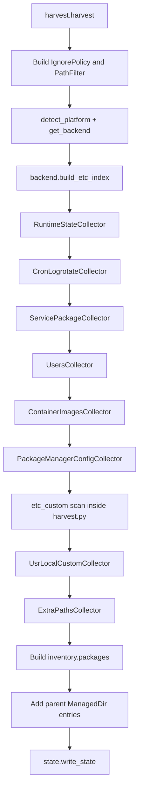
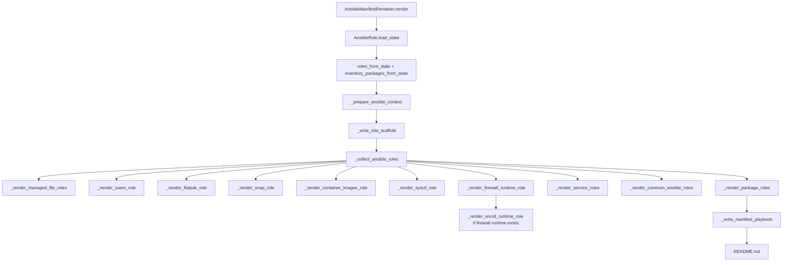
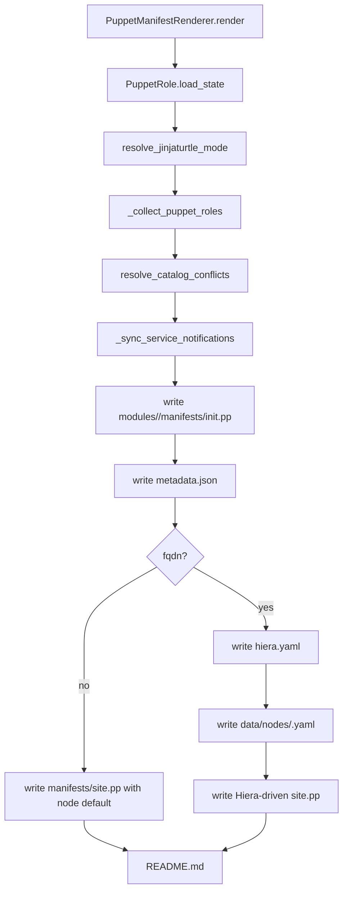
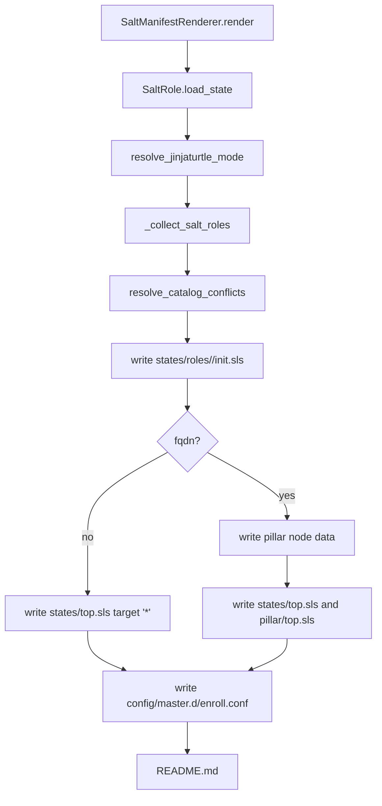
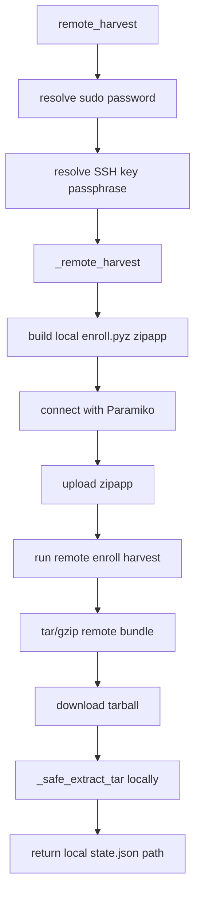

# Enroll Development Guide

Interested in the internals of Enroll?

This guide describes the current `enroll` codebase for maintainers. It focuses on how the project is organised, what calls what, how harvest state flows into generated configuration-management output, and which invariants matter when changing the code.

---

## 1. What Enroll does

`enroll` is a Linux host inspection and configuration-management generation tool.

Its core pipeline is:

```text
Running Linux host
  |
  | enroll harvest
  v
Harvest bundle
  state.json
  artifacts/<role>/<path-relative-to-root>
  |
  | enroll manifest --target ansible|puppet|salt
  v
Generated configuration-management output
  Ansible roles/playbook
  Puppet modules/site.pp/Hiera data
  Salt states/pillar data
```

The harvest bundle is deliberately target-neutral. Ansible, Puppet, and Salt renderers all consume the same `state.json` shape and the same harvested artifacts. Renderer code should translate harvest state into the target's idioms; it should not invent source facts that belong in the harvest.

`enroll diff` is also built around harvest bundles. It compares two harvests and, when `--enforce` is requested, can generate a temporary manifest from the old harvest and apply it locally with the selected target:

```bash
enroll diff --old ./baseline --new ./current --enforce --target ansible
enroll diff --old ./baseline --new ./current --enforce --target puppet
enroll diff --old ./baseline --new ./current --enforce --target salt
```

For enforcement, the user is responsible for having the chosen local apply tool on `PATH`: `ansible-playbook`, `puppet`, or `salt-call`.

---

## 2. Repository layout

The project is a single Python package under `enroll/` with tests under `tests/`.

```text
enroll/
  __main__.py                 python -m enroll entry point
  cli.py                      argparse CLI and subcommand dispatcher
  version.py                  package version lookup

  harvest.py                  top-level local harvest orchestration and runtime helpers
  harvest_types.py            dataclasses persisted into state.json
  harvest_collectors/         feature-specific collectors used by harvest.py
    context.py                HarvestContext and HarvestCollector base
    runtime.py                root-only runtime state collector wrapper
    cron_logrotate.py         cron/logrotate unification collector
    services.py               systemd service + manual package collector
    users.py                  users, SSH public files, Flatpak, Snap collector
    package_manager.py        apt/dnf/yum config collectors
    container_images.py       Docker/Podman image collector
    paths.py                  /usr/local and --include-path collectors

  manifest.py                 target router and SOPS manifest wrapper
  ansible.py                  Ansible renderer
  puppet.py                   Puppet renderer
  salt.py                     Salt renderer
  cm.py                       renderer-neutral CMModule model and grouping helpers
  role_names.py               reserved singleton role-name protection

  accounts.py                 users, SSH public files, Flatpak and Snap discovery
  platform.py                 OS/package-backend abstraction
  debian.py                   dpkg/apt helpers
  rpm.py                      rpm/dnf/yum helpers
  systemd.py                  systemctl wrappers and parsers
  system_paths.py             known config paths and filesystem scanners
  package_hints.py            service/package name and config attribution helpers

  capture.py                  safe file/symlink capture into artifacts/
  fsutil.py                   file md5 + owner/group/mode helpers
  ignore.py                   secret/noise avoidance policy
  pathfilter.py               --include-path / --exclude-path matching and expansion
  state.py                    state.json load/write helpers
  yamlutil.py                 YAML helpers used by renderers/JinjaTurtle
  jinjaturtle.py              optional config-file templating integration

  diff.py                     harvest comparison, notifications, and target-selected enforcement
  explain.py                  human/JSON explanation of harvest contents
  validate.py                 schema and artifact consistency validation
  remote.py                   Paramiko remote harvest implementation
  cache.py                    secure local cache directories for harvests
  sopsutil.py                 SOPS binary encryption/decryption helpers
  schema/state.schema.json    JSON Schema for harvest state

tests/
  test_*.py                   unit tests grouped mostly by module/feature
```

The installed command is configured in `pyproject.toml`:

```toml
[tool.poetry.scripts]
enroll = "enroll.cli:main"
```

`python -m enroll` calls the same CLI through `enroll/__main__.py`.

---

## 3. Main runtime flows

### 3.1 CLI entry flow

All user-facing commands enter through `enroll.cli.main()`.

```text
enroll command
  -> enroll.cli.main()
     -> builds argparse parser and subparsers
     -> discovers optional INI config file
     -> injects config-derived argv defaults before user argv
     -> parses final argv
     -> dispatches by args.cmd
```

The supported subcommands are:

```text
harvest       collect a harvest bundle from a local or remote host
manifest      generate Ansible/Puppet/Salt output from a harvest bundle
single-shot   run harvest and manifest in one command
diff          compare two harvest bundles and optionally enforce old state
explain       produce a human/JSON explanation of a harvest
validate      validate state.json and referenced artifacts
```

`cli.py` should stay orchestration-heavy, not domain-heavy. It should parse flags, handle config/SOPS/remote branching, and then call the relevant module. It should not contain the meaning of a service, package, user, file, renderer resource, or harvest snapshot.

### 3.2 Subcommand call graph

```mermaid
flowchart TD
  A[enroll.cli.main] --> B{args.cmd}
  B -->|harvest local| C[harvest.harvest]
  B -->|harvest remote| D[remote.remote_harvest]
  B -->|manifest| E[manifest.manifest]
  B -->|single-shot local| C
  B -->|single-shot remote| D
  C --> E
  D --> E
  B -->|diff| F[diff.compare_harvests]
  F --> G[diff.format_report]
  F --> H{--enforce?}
  H -->|yes| I[diff.enforce_old_harvest]
  I --> J[manifest.manifest target=ansible|puppet|salt]
  J --> K[ansible-playbook or puppet apply or salt-call]
  B -->|explain| L[explain.explain_state]
  B -->|validate| M[validate.validate_harvest]
```

Important dependency direction:

```text
cli.py
  depends on harvest.py, manifest.py, diff.py, explain.py, validate.py, remote.py

harvest.py
  depends on harvest_collectors, platform backends, capture policy, system scanners

manifest.py
  depends on ansible.py, puppet.py, salt.py

ansible.py / puppet.py / salt.py
  depend on state.py, cm.py, harvested artifacts, and target-specific helpers
```

---

## 4. Harvest bundles

A plaintext harvest bundle is a directory:

```text
<bundle>/
  state.json
  artifacts/
    <role_name>/
      etc/...
      usr/local/...
      sysctl/...
      firewall/...
```

`state.json` is written by `enroll.state.write_state()` and loaded by `enroll.state.load_state()`.

The renderer relies on this invariant:

```text
state.json roles.*.managed_files[*].src_rel
  must correspond to
artifacts/<artifact_role>/<src_rel>
```

For example, a captured `/etc/nginx/nginx.conf` in role `nginx` normally becomes:

```json
{
  "path": "/etc/nginx/nginx.conf",
  "src_rel": "etc/nginx/nginx.conf",
  "owner": "root",
  "group": "root",
  "mode": "0644",
  "reason": "modified_conffile"
}
```

and the artifact is copied to:

```text
artifacts/nginx/etc/nginx/nginx.conf
```

Renderer role/module names can differ from artifact roles, especially when common grouping is enabled. Copy helpers must therefore pass the original artifact role, not blindly use the generated renderer module name.

---

## 5. `state.json` shape and snapshot dataclasses

The top-level state assembled by `harvest.harvest()` is:

```json
{
  "enroll": {
    "version": "...",
    "harvest_time": 123456789
  },
  "host": {
    "hostname": "...",
    "os": "debian|redhat|unknown",
    "pkg_backend": "dpkg|rpm|unknown",
    "os_release": {}
  },
  "inventory": {
    "packages": {}
  },
  "roles": {
    "users": {},
    "flatpak": {},
    "snap": {},
    "container_images": {},
    "services": [],
    "packages": [],
    "apt_config": {},
    "dnf_config": {},
    "firewall_runtime": {},
    "sysctl": {},
    "etc_custom": {},
    "usr_local_custom": {},
    "extra_paths": {}
  }
}
```

The persisted in-memory shapes live in `enroll/harvest_types.py`.

| Dataclass | Purpose |
|---|---|
| `ManagedFile` | A file to recreate, with destination path, artifact path, owner, group, mode, and reason. |
| `ManagedLink` | A symlink to recreate, such as `sites-enabled` entries. |
| `ManagedDir` | A directory to ensure exists, with owner/group/mode. |
| `ExcludedFile` | A path that was considered but skipped, with a reason. |
| `ServiceSnapshot` | One enabled systemd service and its packages/config/state. |
| `PackageSnapshot` | One manual package and related config. `has_config=False` is used when the package should still be installed but no config was found. |
| `UsersSnapshot` | Human users, groups, managed SSH/dotfiles, and per-user Flatpak data. |
| `FlatpakSnapshot` | System Flatpaks and system Flatpak remotes. |
| `SnapSnapshot` | System Snap installs. |
| `ContainerImagesSnapshot` | Docker/Podman image metadata. |
| `AptConfigSnapshot` / `DnfConfigSnapshot` | Package-manager configuration. |
| `EtcCustomSnapshot` | Unowned/custom `/etc` config not attributed elsewhere. |
| `UsrLocalCustomSnapshot` | Selected `/usr/local/etc` files and executable `/usr/local/bin` files. |
| `ExtraPathsSnapshot` | User-requested `--include-path` files/directories. |
| `FirewallRuntimeSnapshot` | Generated artifacts from live ipset/iptables state. |
| `SysctlSnapshot` | Generated `/etc/sysctl.d/99-enroll.conf` from live writable sysctls. |

The JSON Schema in `enroll/schema/state.schema.json` is the validation contract for persisted harvests.

---

## 6. Harvest orchestration

The local harvest entry point is:

```python
enroll.harvest.harvest(
    bundle_dir,
    policy=None,
    dangerous=False,
    include_paths=None,
    exclude_paths=None,
)
```

It returns the path to the written `state.json`.

### 6.1 High-level harvest order

The order matters because harvest maintains a global set of captured destination paths. Once a path is captured into one role, later collectors normally skip it.



### 6.2 `HarvestContext`

`HarvestContext` lives in `harvest_collectors/context.py`. It is passed to collectors instead of passing many individual dependencies.

```python
@dataclass
class HarvestContext:
    bundle_dir: str
    policy: IgnorePolicy
    path_filter: PathFilter
    platform: Dict[str, Any]
    backend: Any
    installed_pkgs: Dict[str, Any]
    installed_names: Set[str]
    owned_etc: Set[str]
    etc_owner_map: Dict[str, str]
    topdir_to_pkgs: Dict[str, Set[str]]
    pkg_to_etc_paths: Dict[str, List[str]]
    captured_global: Set[str]
```

New collectors should generally accept a `HarvestContext` and return dataclass snapshots from `harvest_types.py`.

### 6.3 Global de-duplication

The harvester tries to avoid two generated roles owning the same destination path. This avoids duplicate config-manager resources and confusing diffs.

`captured_global` is passed into `capture.capture_file()` and `capture.capture_link()`. If a destination path has already been seen, later collection attempts return without capturing it again.

This is one of the most important invariants in the project:

> A destination path should normally appear in only one generated role.

Puppet and Salt also run `cm.resolve_catalog_conflicts()` after renderer role collection because they compile a single global catalog and duplicate resources are hard failures.

---

## 7. File capture and safety policy

### 7.1 `capture_file()`

`capture.capture_file()` decides whether to copy a file into `artifacts/` and record it in a snapshot.

```text
capture_file(abs_path, role_name, reason, policy, path_filter, ...)
  -> skip if already seen globally or in this role
  -> skip if --exclude-path matches
  -> ask IgnorePolicy.deny_reason(abs_path)
  -> stat owner/group/mode with fsutil.stat_triplet()
  -> copy to artifacts/<role_name>/<abs_path without leading slash>
  -> append ManagedFile
  -> mark seen in role/global
```

`fsutil.stat_triplet()` returns owner, group, and a zero-padded octal mode string. It falls back to numeric uid/gid strings if user/group names cannot be resolved.

### 7.2 `capture_link()`

`capture.capture_link()` records symlinks as `ManagedLink` entries rather than copying their targets. It is used for meaningful enablement symlinks, especially in nginx/apache-style trees such as:

```text
/etc/nginx/sites-enabled/*
/etc/nginx/modules-enabled/*
/etc/apache2/conf-enabled/*
/etc/apache2/mods-enabled/*
/etc/apache2/sites-enabled/*
```

### 7.3 User shell dotfiles

`capture.capture_user_shell_dotfiles()` is called by `UsersCollector`, but only enabled when the harvest policy is dangerous.

In dangerous mode:

- `.bashrc`, `.profile`, and `.bash_logout` are captured only if they differ from `/etc/skel` baselines.
- `.bash_aliases` is captured if present because there may be no skel baseline.

Outside dangerous mode, Enroll records a note explaining that shell dotfiles were not auto-harvested. Users can still include specific files via `--include-path`, but the normal `IgnorePolicy` still applies unless `--dangerous` is also used.

### 7.4 `IgnorePolicy`

`ignore.IgnorePolicy` is the default secret/noise avoidance layer.

By default it skips likely sensitive or low-value files such as:

- `/etc/shadow`, `/etc/gshadow`, and backup variants,
- SSH host private keys,
- private SSL/Let's Encrypt material,
- log files and editor backups,
- files larger than `max_file_bytes` (`256_000` by default),
- binary-like files except known keyring formats,
- sampled non-comment content that looks sensitive, such as private keys, `password=`, `token`, `secret`, or `api_key`.

`--dangerous` sets `policy.dangerous = True`, disabling deny-globs and content sniffing. This is intentional and should remain explicit.

The policy has separate methods for different filesystem types:

- `deny_reason(path)` for regular files,
- `deny_reason_dir(path)` for directories,
- `deny_reason_link(path)` for symlinks.

### 7.5 `PathFilter`

`pathfilter.PathFilter` implements user-supplied path controls:

- `--include-path` adds extra files/directories to the `extra_paths` role.
- `--exclude-path` removes matching paths from all harvesting.
- Excludes always win over includes.

Pattern styles:

```text
/plain/path        exact path or directory-prefix match
glob:/path/**/*.x  forced glob
/path/**/*.x       inferred glob because it contains glob characters
re:^/path/...$     regex
regex:^/path/...$  regex
```

`expand_includes()` is conservative: it ignores symlinks, respects excludes, caps file counts, and returns notes for unmatched patterns or caps.

---

## 8. Platform and package backends

`platform.py` abstracts distribution-specific package behaviour.

```text
platform.detect_platform()
  -> reads /etc/os-release
  -> returns PlatformInfo(os_family, pkg_backend, os_release)

platform.get_backend(info)
  -> DpkgBackend for Debian-like systems
  -> RpmBackend for RedHat/Fedora-like systems
```

The backend interface is `PackageBackend`:

```python
owner_of_path(path)
list_manual_packages()
installed_packages()
build_etc_index()
specific_paths_for_hints()
is_pkg_config_path(path)
modified_paths(pkg, paths)
```

### 8.1 Debian backend

`DpkgBackend` delegates to `debian.py`.

It uses dpkg/apt data to provide package ownership, manual package lists, installed package inventory, `/etc` indexes, conffile hashes, and packaged-file md5 baselines.

`DpkgBackend.modified_paths()` identifies:

- `modified_conffile` when a dpkg conffile hash differs,
- `modified_packaged_file` when a packaged file md5 differs.

It deliberately leaves `/etc/apt`-style package-manager configuration for the `apt_config` role.

### 8.2 RPM backend

`RpmBackend` delegates to `rpm.py`.

It provides package ownership, manual package lists, installed package inventory, `/etc` indexes, RPM config file lists, and `rpm -V` style modified-file detection.

RPM-family package-manager config paths such as `/etc/dnf`, `/etc/yum`, `/etc/yum.conf`, `/etc/yum.repos.d`, and `/etc/pki/rpm-gpg` are collected into `dnf_config`, not arbitrary package roles.

### 8.3 Adding a new package backend

To support another package system:

1. implement a `PackageBackend` subclass,
2. route it from `platform.get_backend()`,
3. provide ownership lookup, manual package listing, installed package inventory, `/etc` indexing, modified config detection, and package-manager config exclusion,
4. add backend tests comparable to `test_debian.py`, `test_rpm.py`, and `test_platform.py`.

---

## 9. Harvest collectors in detail

Collectors live under `enroll/harvest_collectors/`.

### 9.1 `RuntimeStateCollector`

File: `harvest_collectors/runtime.py`

This wrapper collects root-only live runtime state:

- writable sysctl state,
- live ipset state,
- live IPv4 iptables state,
- live IPv6 iptables state.

The actual helper implementations currently live in `harvest.py`:

- `_collect_sysctl_snapshot()`,
- `_collect_firewall_runtime_snapshot()`,
- `_parse_sysctl_a_output()`,
- `_iptables_save_has_state()`,
- `_ipset_save_has_state()`.

If the process is not root, runtime capture returns empty snapshots with explanatory notes.

#### Sysctl capture

Sysctl capture runs `sysctl -a`, filters to writable/persistable single-line keys, and writes a generated artifact:

```text
artifacts/sysctl/sysctl/99-enroll.conf
```

The destination managed by renderers is:

```text
/etc/sysctl.d/99-enroll.conf
```

The filter skips volatile/action/identity keys and inactive mutually-exclusive zero values. This avoids generating config that fails or is noisy on replay.

#### Firewall runtime capture

Runtime firewall capture is a fallback. Enroll first checks for persistent firewall config such as:

```text
/etc/iptables/rules.v4
/etc/iptables/rules.v6
/etc/sysconfig/iptables
/etc/sysconfig/ip6tables
/etc/ipset.conf
/etc/ipset/*
```

If persistent files exist for a family, live runtime capture for that family is skipped. If no persistent file exists and live state is meaningful, Enroll writes generated artifacts such as:

```text
artifacts/firewall_runtime/firewall/ipset.save
artifacts/firewall_runtime/firewall/iptables.v4
artifacts/firewall_runtime/firewall/iptables.v6
```

Renderers should only create a firewall runtime role when at least one runtime artifact exists. When firewall runtime is rendered, Ansible/Puppet/Salt also create an `enroll_runtime` role/module/state to own `/etc/enroll` before `/etc/enroll/firewall`.

### 9.2 `CronLogrotateCollector`

File: `harvest_collectors/cron_logrotate.py`

This collector runs before service/package collection to prevent cron and logrotate snippets from being scattered across unrelated roles.

It detects cron packages such as `cron`, `cronie`, `cronie-anacron`, `vixie-cron`, and `fcron`, and detects `logrotate` separately.

It captures cron-related paths such as:

```text
/etc/crontab
/etc/cron.d/*
/etc/cron.hourly/*
/etc/cron.daily/*
/var/spool/cron/*
/var/spool/crontabs/*
/var/spool/anacron/*
```

It captures logrotate paths such as:

```text
/etc/logrotate.conf
/etc/logrotate.d/*
```

It returns `PackageSnapshot` objects for `cron` and `logrotate` when those packages exist.

### 9.3 `ServicePackageCollector`

File: `harvest_collectors/services.py`

This collector produces:

- `ServiceSnapshot` objects for enabled systemd services,
- `PackageSnapshot` objects for manual packages not already covered by services,
- alias maps used by later `/etc` attribution,
- `seen_by_role` state reused by later collectors.

For each enabled service it:

1. derives a safe role name from the unit,
2. queries systemd metadata,
3. infers packages from the unit fragment owner, `ExecStart`, and related `/etc` topdirs,
4. collects unit drop-ins, environment files, distro-specific likely config files, and modified package-owned config,
5. collects related unowned `/etc/<hint>` and `/etc/<hint>.d` files,
6. captures candidates with `capture_file()`,
7. builds a `ServiceSnapshot`.

It also collects timer override files. If a timer triggers a known service, timer files are attached to that service snapshot. Otherwise, the timer is associated with inferred packages.

Manual packages are processed after services. Packages already covered by service snapshots are not duplicated as standalone package roles. Packages with no detected config are still represented with `has_config=False` so renderers can install them.

Known enablement symlinks for nginx/apache are captured as `ManagedLink` entries at the end of the collector.

### 9.4 `UsersCollector`

File: `harvest_collectors/users.py`

This collector returns a `UsersCollection` containing:

- `UsersSnapshot`,
- `FlatpakSnapshot`,
- `SnapSnapshot`.

User discovery is in `accounts.collect_non_system_users()`. It reads `/etc/login.defs`, `/etc/passwd`, `/etc/group`, home directories, and user Flatpak installs. It filters out users below `UID_MIN`, `root`, `nobody`, and non-login shells such as `nologin` and `/bin/false`.

Default user file capture is intentionally narrow:

- `authorized_keys`,
- safe public SSH material where supported by helpers.

Automatic shell dotfile capture only runs in dangerous mode.

The same collector discovers:

- system Flatpaks,
- system Flatpak remotes,
- per-user Flatpaks,
- per-user Flatpak remotes,
- system Snaps.

### 9.5 `ContainerImagesCollector`

File: `harvest_collectors/container_images.py`

This collector inspects Docker and Podman image caches when the relevant engine exists.

For each engine it:

1. runs `<engine> image ls -q --no-trunc`,
2. inspects images in chunks with `<engine> image inspect ...`,
3. normalises image IDs, tags, digests, OS/architecture/platform fields, and tag aliases,
4. prefers digest-pinned pull refs from `RepoDigests`.

Renderers only enforce exact pull state for images with a usable digest. Images with only local tags and no digest are represented with notes rather than fake reproducibility.

### 9.6 `PackageManagerConfigCollector`

File: `harvest_collectors/package_manager.py`

This collector emits a dedicated package-manager config snapshot:

- `apt_config` on dpkg systems,
- `dnf_config` on rpm systems.

APT capture includes `/etc/apt`, sources, `.sources` files, trusted keyrings, and keyrings referenced through `signed-by` / `Signed-By`.

DNF/YUM capture includes `/etc/dnf`, `/etc/yum`, `/etc/yum.conf`, `/etc/yum.repos.d/*.repo`, and `/etc/pki/rpm-gpg/*`.

### 9.7 `etc_custom` scan

`etc_custom` is still assembled inside `harvest.harvest()` rather than in its own collector.

It captures:

1. essential system config from `system_paths.iter_system_capture_paths()`,
2. remaining unowned config-like files found by walking `/etc`.

Before adding shared snippets such as `/etc/logrotate.d/*` or `/etc/cron.d/*` to `etc_custom`, `_target_role_for_shared_snippet()` tries to attach them to a more meaningful service/package role.

### 9.8 `UsrLocalCustomCollector`

File: `harvest_collectors/paths.py`

This collector creates `usr_local_custom` from:

- files under `/usr/local/etc`,
- executable files under `/usr/local/bin`.

It respects `IgnorePolicy`, `PathFilter`, and global de-duplication.

### 9.9 `ExtraPathsCollector`

File: `harvest_collectors/paths.py`

This collector handles `--include-path` and `--exclude-path` and creates `extra_paths`.

For included directories, it records directory metadata as `ManagedDir` entries while walking. For included files, it relies on `expand_includes()` and then `capture_file()`.

---

## 10. Path scanners and package hints

`system_paths.py` contains known path lists and filesystem scanners.

Important functions and constants:

- `ALLOWED_UNOWNED_EXTS` decides which unowned `/etc` files look config-like.
- `MAX_FILES_CAP` and `MAX_UNOWNED_FILES_PER_ROLE` cap broad scans.
- `is_confish()` checks whether a path looks like configuration.
- `scan_unowned_under_roots()` finds unowned files under candidate roots.
- `iter_matching_files()` expands glob specs and walks directory hits.
- `iter_apt_capture_paths()` and `iter_dnf_capture_paths()` collect package-manager config.
- `iter_system_capture_paths()` returns fixed essential system config candidates.
- `persistent_ipset_globs()`, `persistent_iptables_v4_globs()`, and `persistent_iptables_v6_globs()` support runtime firewall fallback decisions.

`package_hints.py` turns package/unit names into stable role names and attempts to infer relationships.

Important helpers:

- `safe_name()`,
- `role_id()`,
- `role_name_from_unit()`,
- `role_name_from_pkg()`,
- `package_section_from_installations()`,
- `hint_names()`,
- `add_pkgs_from_etc_topdirs()`,
- `maybe_add_specific_paths()`.

`SHARED_ETC_TOPDIRS` in `package_hints.py` prevents shared directories such as `/etc/default`, `/etc/pam.d`, `/etc/systemd`, `/etc/ssh`, `/etc/apt`, and `/etc/dnf` from being attributed too broadly to one package.

`role_names.py` protects singleton role names such as `users`, `flatpak`, `snap`, `container_images`, `apt_config`, `dnf_config`, `firewall_runtime`, `sysctl`, `etc_custom`, `usr_local_custom`, and `extra_paths` from collisions with package/service-derived roles.

---

## 11. Manifest orchestration

`manifest.py` is a target router and SOPS wrapper. It does not render target resources itself.

Entry point:

```python
manifest(
    bundle_dir,
    out,
    fqdn=None,
    jinjaturtle="auto",
    sops_fingerprints=None,
    no_common_roles=False,
    target="ansible",
)
```

Plain mode dispatches to:

```text
target=ansible -> ansible.manifest_from_bundle_dir(..., jinjaturtle=..., no_common_roles=...)
target=puppet  -> puppet.manifest_from_bundle_dir(..., jinjaturtle=..., no_common_roles=...)
target=salt    -> salt.manifest_from_bundle_dir(..., jinjaturtle=..., no_common_roles=...)
```

SOPS mode:

1. accepts an already-decrypted bundle directory or a SOPS-encrypted harvest tarball,
2. decrypts/extracts with safe tar extraction when needed,
3. renders target output into a secure temp directory,
4. tars the manifest directory under a `manifest/` prefix,
5. encrypts the tarball with SOPS,
6. returns the encrypted output path.

The renderers do not know about SOPS.

Note: Manifest deliberately hooks into validate() to make sure the harvest meets the schema and
doesn't contain dangerous tamperings before turning it into config management code.

---

## 12. The renderer-neutral `CMModule` model

File: `cm.py`

`CMModule` is the shared resource model used heavily by Puppet and Salt and partially by Ansible.

```python
@dataclass
class CMModule:
    role_name: str
    module_name: str
    packages: Set[str]
    groups: Set[str]
    users: Dict[str, Dict[str, Any]]
    dirs: Dict[str, Dict[str, Any]]
    files: Dict[str, Dict[str, Any]]
    links: Dict[str, Dict[str, Any]]
    services: Dict[str, Dict[str, Any]]
    firewall_runtime: Dict[str, Any]
    notes: List[str]
```

Important methods and helpers include:

- `add_managed_dir()`, `add_managed_file()`, `add_managed_link()`,
- `add_package_snapshot()`,
- `add_service_snapshot_state()`,
- `user_records_from_snapshot()`,
- `add_flatpak_snapshot()`, `add_snap_snapshot()`,
- `add_firewall_runtime_snapshot()`,
- `package_service_entries()`,
- `active_service_units_by_package()`,
- `active_service_units_for_package_snapshot()`,
- `remove_directory_resource_conflicts()`.

### 12.1 Common role grouping

`CMModule.package_service_entries()` is the shared grouping mechanism for package and service snapshots.

`use_common_roles=True` groups package/service snapshots into section/group roles such as Debian Section or RPM Group labels. `use_common_roles=False` preserves one generated role/module/state per package or service snapshot.

Default behaviour:

```text
normal manifest, no --no-common-roles: group package/service roles
--fqdn mode: no common grouping
--no-common-roles: no common grouping
```

`--fqdn` implies no common roles because host-specific output should preserve per-host state rather than merging unrelated resources into shared roles.

### 12.2 Catalog conflict resolution

`resolve_catalog_conflicts()` runs for Puppet and Salt.

It removes duplicates across generated modules/states for:

- packages,
- groups,
- users,
- directories,
- files,
- symlinks,
- services.

It also removes directory resources that conflict with a file or link at the same path. This matters because Puppet and Salt compile a single catalog; duplicates that Ansible might tolerate can fail hard there.

---

## 13. Ansible renderer

File: `ansible.py`

Entry point:

```python
ansible.manifest_from_bundle_dir(
    bundle_dir,
    out_dir,
    fqdn=None,
    jinjaturtle="auto",
    no_common_roles=False,
)
```

It instantiates `AnsibleManifestRenderer(...).render()`.

### 13.1 Ansible render flow



### 13.2 Output layout

Default single-site output:

```text
<out>/
  ansible.cfg
  playbook.yml
  README.md
  requirements.yml
  roles/
    <role>/
      tasks/main.yml
      handlers/main.yml
      defaults/main.yml
      meta/main.yml
      files/...
      templates/...
```

`--fqdn` site-mode output adds inventory and host vars:

```text
<out>/
  inventory/
    hosts.yml
    host_vars/<fqdn>/<role>/
      main.yml
      .files/...
  roles/<role>/...
```

In default mode, variables normally live in `roles/<role>/defaults/main.yml` and raw files live under `roles/<role>/files/`.

In `--fqdn` mode, host-specific values and artifacts live under `inventory/host_vars/<fqdn>/<role>/`, while reusable role scaffolding remains under `roles/`.

### 13.3 Role ordering

Ansible playbook roles are ordered intentionally:

1. package-manager config roles (`apt_config`, `dnf_config`),
2. common grouped roles,
3. standalone package roles,
4. service roles,
5. custom file roles (`etc_custom`, `usr_local_custom`, `extra_paths`),
6. Flatpak, Snap, container images, users,
7. cron/logrotate moved toward the end when present,
8. runtime roles (`enroll_runtime`, `sysctl`, `firewall_runtime`).

`enroll_runtime` is rendered only when firewall runtime is rendered.

### 13.4 Role tags

Generated playbooks tag roles with `role_<safe_role_name>`. `diff --enforce --target ansible` uses these tags to narrow enforcement to roles relevant to the drift report when it can.

Puppet and Salt enforcement do not currently narrow to per-role tags; they run the full generated local manifest/state tree.

### 13.5 Ansible and JinjaTurtle

Ansible uses `jinjaturtle.jinjify_managed_files()`.

When JinjaTurtle is enabled and supports a harvested config file, the renderer can write:

- a Jinja2 template under `templates/`,
- variables in `defaults/main.yml` or `inventory/host_vars/<fqdn>/<role>/main.yml`.

If JinjaTurtle is unavailable in `auto` mode, fails, emits missing variables, or does not support the path, Ansible falls back to copying the raw harvested file.

---

## 14. Puppet renderer

File: `puppet.py`

Entry point:

```python
puppet.manifest_from_bundle_dir(
    bundle_dir,
    out_dir,
    fqdn=None,
    no_common_roles=False,
    jinjaturtle="auto",
)
```

It instantiates `PuppetManifestRenderer(...).render()`.

### 14.1 Puppet render flow



### 14.2 `PuppetRole`

`PuppetRole` extends `CMModule` and converts snapshots into Puppet-friendly resources. It handles:

- packages,
- users and groups,
- managed dirs/files/symlinks,
- services,
- sysctl apply execs,
- Flatpak remotes/apps via guarded `exec`,
- Snap installs via guarded `exec`,
- Docker/Podman images by digest via guarded `exec`,
- firewall runtime files and refresh-only restore execs,
- JinjaTurtle ERB templates and class/Hiera parameter values.

`_puppet_name()` sanitises module names and avoids Puppet reserved words such as `default`, `class`, `node`, `site`, and `init`.

### 14.3 Output layout

Default mode:

```text
<out>/
  manifests/site.pp
  README.md
  modules/
    <module>/
      metadata.json
      manifests/init.pp
      files/...
      templates/...
```

Default `site.pp` includes generated classes in manifest order under a `node default` or named node block.

### 14.4 Puppet `--fqdn` / Hiera mode

When `--fqdn` is supplied, Puppet output switches to Hiera-style node data:

```text
<out>/
  hiera.yaml
  manifests/site.pp
  data/
    common.yaml
    nodes/<fqdn>.yaml
  modules/
    <module>/
      metadata.json
      manifests/init.pp
      files/nodes/<fqdn>/...
      templates/...
```

In this mode:

- `site.pp` includes classes from Hiera key `enroll::classes`,
- `data/nodes/<fqdn>.yaml` contains class list and parameter data,
- module classes are data-driven via Automatic Parameter Lookup,
- node-specific raw file artifacts live under `modules/<module>/files/nodes/<fqdn>/...`,
- JinjaTurtle ERB template values are written into node Hiera data.

Re-running Enroll with another `--fqdn` into the same output directory is intended to add or replace that node's YAML without deleting existing node data.

### 14.5 Puppet and JinjaTurtle

Puppet now participates in the shared JinjaTurtle integration.

When enabled, Puppet calls `jinjaturtle` with ERB-specific options:

```text
--template-engine erb
--puppet-class <module_name>
```

The resulting template is written under:

```text
modules/<module>/templates/<src_rel>.erb
```

Static single-node mode renders class parameters with defaults and uses:

```puppet
content => template('<module>/<src_rel>.erb')
```

Hiera mode writes template parameter values into `data/nodes/<fqdn>.yaml` and renders data-driven file resources.

`jinjaturtle.missing_erb_template_vars()` checks that ERB instance variables such as `@main_key` have matching context/Hiera data. If variables are missing, Enroll falls back to raw file copying rather than emitting a broken Puppet template.

---

## 15. Salt renderer

File: `salt.py`

Entry point:

```python
salt.manifest_from_bundle_dir(
    bundle_dir,
    out_dir,
    fqdn=None,
    no_common_roles=False,
    jinjaturtle="auto",
)
```

It instantiates `SaltManifestRenderer(...).render()`.

### 15.1 Salt render flow



### 15.2 `SaltRole`

`SaltRole` extends `CMModule` and changes `managed_owner_attr` to `user`, because Salt `file.managed` uses `user` rather than `owner`.

It prepares:

- packages as `pkg.installed`,
- groups as `group.present`,
- users as `user.present`,
- dirs/files/symlinks as Salt `file.*` states,
- services as `service.running` or `service.dead`,
- Flatpaks/Snaps via guarded `cmd.run`,
- Docker/Podman images via guarded `cmd.run`,
- firewall runtime restore commands,
- optional Jinja templates for managed files.

### 15.3 Output layout

Default mode:

```text
<out>/
  README.md
  config/master.d/enroll.conf
  states/
    top.sls
    roles/<role>/
      init.sls
      files/...
      templates/...
```

`--fqdn` mode:

```text
<out>/
  states/
    top.sls
    roles/<role>/init.sls
  pillar/
    top.sls
    nodes/<sanitised-fqdn>_<digest>.sls
```

The Salt renderer can accumulate node data in `--fqdn` mode and preserves existing top data where appropriate.

### 15.4 Salt and JinjaTurtle

Salt uses `jinjaturtle.jinjify_artifact()` directly. When successful, a managed file becomes a Salt `file.managed` with:

```yaml
source: salt://roles/<role>/templates/<src_rel>.j2
template: jinja
context: {...}
```

Salt has one additional compatibility step: `_saltify_jinjaturtle_template()` rewrites Ansible-oriented `to_json(...)` filters emitted by JinjaTurtle into Salt-safe context variables or `tojson` filters.

If templating fails or is unsupported, the renderer falls back to a literal file copy under `files/`.

---

## 16. Shared JinjaTurtle integration

File: `jinjaturtle.py`

JinjaTurtle mode is resolved by:

```python
resolve_jinjaturtle_mode("auto" | "on" | "off")
```

Semantics:

- `auto`: use `jinjaturtle` when it exists on `PATH`; otherwise copy raw files.
- `on`: require `jinjaturtle`; error if missing.
- `off`: never use it.

Supported path types include structured config suffixes:

```text
.ini .cfg .json .toml .yaml .yml .xml .repo
```

and systemd unit-like suffixes:

```text
.service .socket .target .timer .path .mount .automount .slice .swap .scope .link .netdev .network
```

Special format forcing is used for:

- `main.cf` -> `postfix`,
- systemd unit files -> `systemd`,
- `sshd_config`, `ssh_config`, and matching `*.conf` snippets under `sshd_config.d` / `ssh_config.d` -> `ssh`.

The central helper is:

```python
jinjify_artifact(
    bundle_dir,
    artifact_role,
    src_rel,
    dest_path,
    template_root,
    jt_exe=...,
    jt_enabled=...,
    template_engine="jinja2" | "erb",
    puppet_class=...,      # Puppet only
)
```

Ansible uses `jinjify_managed_files()` because it merges variables into role defaults or host vars. Salt uses `jinjify_artifact()` directly because context lives with each `file.managed`. Puppet uses `jinjify_artifact(..., template_engine="erb", puppet_class=<module>)` so variables line up with Puppet class/Hiera names.

Safety checks:

- `missing_jinja_template_vars()` rejects Jinja2 templates that reference absent variables.
- `missing_erb_template_vars()` rejects ERB templates that reference absent Puppet/Hiera variables.

When checks fail, Enroll deletes obsolete generated templates when appropriate and falls back to raw file copying.

---

## 17. Diff, notifications, and enforcement

File: `diff.py`

### 17.1 Inputs

`compare_harvests()` accepts:

- bundle directories,
- direct `state.json` paths,
- plain `.tar.gz` / `.tgz` bundles,
- SOPS-encrypted bundles when `sops_mode=True` or the name ends with `.sops`.

Bundle resolution is handled by `_bundle_from_input()`, which reuses `remote._safe_extract_tar()` for tarball extraction.

### 17.2 What diff compares

`compare_harvests()` compares:

- package add/remove/version changes,
- enabled systemd unit add/remove/state/package changes,
- user add/remove/field changes,
- managed file add/remove/content/metadata changes.

File content changes are detected by hashing artifacts.

`--exclude-path` filtering applies only to file drift reporting, not package/service/user diffs.

`--ignore-package-versions` suppresses package version-only drift from both the report and `has_changes`, but package additions/removals are still reported.

Reports are formatted by:

```python
format_report(report, fmt="text" | "markdown" | "json")
```

### 17.3 Enforcement decision

`has_enforceable_drift()` is intentionally conservative.

Enforceable drift includes:

- packages that were removed from the current host but existed in the baseline,
- baseline services that were removed or changed in meaningful non-package fields,
- baseline users that were removed or changed,
- baseline files that were removed or changed.

Not enforceable:

- newly installed packages,
- package version changes alone,
- newly enabled services,
- newly added users,
- newly added managed files.

This keeps `--enforce` focused on restoring baseline state rather than deleting unknown current state or downgrading packages.

### 17.4 Target-selected enforcement

`enforce_old_harvest()` now accepts `target="ansible" | "puppet" | "salt"`.

It performs:

1. resolve the old/baseline harvest,
2. build a best-effort enforcement plan from the diff report,
3. generate a temporary manifest from the old harvest using the selected target,
4. run the matching local apply tool,
5. attach enforcement metadata to the diff report.

Target commands:

```text
ansible -> ansible-playbook -i localhost, -c local playbook.yml
puppet  -> puppet apply --modulepath ./modules [--hiera_config ./hiera.yaml] manifests/site.pp
salt    -> salt-call --local --file-root ./states [--pillar-root ./pillar] state.apply
```

Only Ansible uses generated per-role tags to narrow the apply scope. Puppet and Salt enforcement deliberately run the full generated local manifest/state tree for now. The JSON report keeps target-specific compatibility fields such as `ansible_playbook`, `puppet`, or `salt_call`.

### 17.5 Notifications

`diff.py` also supports webhooks and email notifications:

- `post_webhook()` sends JSON/text/markdown payloads with optional extra headers.
- `send_email()` uses SMTP when configured or local sendmail when SMTP is omitted.

CLI notification options are only sent when differences exist unless `--notify-always` is set.

---

## 18. Explanation and validation

### 18.1 `explain.py`

`explain_state()` reads a harvest and produces text or JSON explaining:

- host metadata,
- role summaries,
- users,
- services,
- package snapshots,
- runtime firewall,
- sysctl,
- custom files,
- inventory packages,
- notes and exclusion reasons.

This is intended to answer “what did Enroll collect and why?”

### 18.2 `validate.py`

`validate_harvest()` checks:

1. `state.json` exists,
2. it parses as JSON,
3. it validates against the vendored schema unless `--no-schema` is set,
4. every `managed_file.src_rel` points to an artifact file,
5. firewall runtime generated artifacts exist,
6. there are no unreferenced artifact files, reported as warnings.
7. there are no malicious or unsafe bits such as symlinks/hardlinks etc traversing out of the artifact tree

It returns a `ValidationResult` with `errors`, `warnings`, `ok()`, `to_dict()`, and `to_text()`.

The CLI supports local schema override with `--schema`, warning failure with `--fail-on-warnings`, JSON/text output, and `--out`.

Note that manifest() hooks into validate() to make sure the harvest is safe before rendering it into config management code.

---

## 19. Remote harvesting

File: `remote.py`

Remote mode is called from `cli.py` when `--remote-host` is supplied.

Public entry point:

```python
remote_harvest(...)
```

It wraps `_remote_harvest()` and handles:

- optional sudo password prompting,
- optional SSH key passphrase prompting or environment variable lookup,
- retrying when remote sudo requires a password,
- retrying when an encrypted SSH private key needs a passphrase.

### 19.1 Remote harvest flow



`_build_enroll_pyz()` packages the local `enroll` Python package into a zipapp and uses `enroll.cli:main` as its entry point.

### 19.2 SSH config support

`--remote-ssh-config` enables Paramiko `SSHConfig` support for settings such as:

- `HostName`,
- `Port`,
- `User`,
- `IdentityFile`,
- `ConnectTimeout`,
- `ProxyCommand`,
- `AddressFamily`,
- `HostKeyAlias` where supported by the connection logic.

Unknown host keys are rejected by default through Paramiko's reject policy. Users should have valid host keys in known hosts.

### 19.3 Safe tar extraction

`_safe_extract_tar()` validates tar members before extraction and rejects:

- absolute paths,
- `..` traversal,
- symlinks,
- hardlinks,
- device nodes,
- anything resolving outside the destination.

This helper is reused by remote harvest, manifest SOPS extraction, and diff bundle resolution.

---

## 20. SOPS support

File: `sopsutil.py`

SOPS support is binary tarball encryption, not field-level YAML encryption.

### 20.1 Harvest SOPS mode

`enroll harvest --sops <fingerprint...>`:

1. harvests into a secure temp directory,
2. tars the bundle,
3. encrypts it with SOPS binary mode,
4. writes `harvest.tar.gz.sops` or the requested output file.

### 20.2 Manifest SOPS mode

`enroll manifest --sops <fingerprint...>`:

1. decrypts/extracts the harvest if needed,
2. generates the chosen target manifest in a temp directory,
3. tars the generated output,
4. encrypts it as a single SOPS file.

### 20.3 Helpers

`sopsutil.py` provides:

- `find_sops_cmd()`,
- `require_sops_cmd()`,
- `encrypt_file_binary()`,
- `decrypt_file_binary_to()`.

Encryption/decryption helpers write via temp files and default to mode `0600`.

---

## 21. Configuration file support

`cli.py` supports optional INI config files.

Discovery order:

1. `--no-config` disables config loading,
2. `--config PATH` or `-c PATH`,
3. `$ENROLL_CONFIG`,
4. `./enroll.ini`,
5. `./.enroll.ini`,
6. `$XDG_CONFIG_HOME/enroll/enroll.ini`,
7. `~/.config/enroll/enroll.ini`.

Config sections are translated into argv tokens by `_inject_config_argv()`:

- `[enroll]` for global options,
- `[harvest]`, `[manifest]`, `[single-shot]`, `[diff]`, `[explain]`, `[validate]` for subcommand options,
- `[single_shot]` is accepted as an alias for `[single-shot]`.

CLI flags win because config-derived tokens are inserted before user-supplied argv tokens.

The translation is argparse-driven, so new flags often gain config-file support automatically as long as they are represented by normal argparse actions.

---

## 22. CLI flags that affect multiple layers

### 22.1 `--target`

`--target ansible|puppet|salt` exists for:

- `enroll manifest`,
- `enroll single-shot`,
- `enroll diff --enforce`.

For `manifest` and `single-shot`, it chooses the output renderer. For `diff --enforce`, it chooses both the temporary manifest target and the local apply tool.

### 22.2 `--fqdn`

`--fqdn` changes output semantics, not just filenames:

- Ansible: uses inventory/host_vars and host-specific artifacts.
- Puppet: uses Hiera node data and Hiera-driven classes.
- Salt: uses pillar node data and minion-targeted top files.

`--fqdn` implies no common role grouping.

### 22.3 `--no-common-roles`

Disables the default grouping of package/service snapshots by Debian Section or RPM Group. This preserves one generated role/module/state per package or unit snapshot.

### 22.4 `--jinjaturtle` / `--no-jinjaturtle`

The CLI maps these to renderer mode strings:

```text
no flag           -> auto
--jinjaturtle     -> on
--no-jinjaturtle  -> off
```

All three manifest targets receive this mode. Puppet uses ERB when JinjaTurtle is enabled; Ansible and Salt use Jinja2.

---

## 23. Tests and how to navigate them

Run tests with:

```bash
poetry install
poetry run pytest
```

or the repository helper when appropriate:

```bash
./tests.sh
```

Important test files:

| Test file | What it covers |
|---|---|
| `test_cli.py` | argparse dispatch, remote flags, manifest target forwarding, single-shot flow. |
| `test_cli_config_and_sops.py`, `test_cli_helpers.py` | config-file injection and SOPS output helpers. |
| `test_harvest.py`, `test_harvest_helpers.py` | harvest orchestration, sysctl/firewall helpers, role naming. |
| `test_harvest_collectors.py` | runtime and container image collectors. |
| `test_harvest_cron_logrotate.py` | cron/logrotate unification. |
| `test_harvest_symlinks.py` | nginx/apache enabled symlink capture. |
| `test_accounts.py` | users, Flatpak, Snap parsing/discovery. |
| `test_ignore.py`, `test_ignore_dir.py` | secret/noise policy. |
| `test_pathfilter.py` | include/exclude matching and expansion. |
| `test_platform.py`, `test_platform_backends.py` | platform detection and backend behaviour. |
| `test_debian.py`, `test_rpm.py`, `test_rpm_run.py` | package manager helpers. |
| `test_manifest.py`, `test_manifest_ansible.py` | Ansible rendering and role behaviour. |
| `test_manifest_puppet.py` | Puppet rendering, Hiera mode, reserved names, firewall/container/Flatpak/Snap/JinjaTurtle support. |
| `test_manifest_salt.py` | Salt rendering, pillar mode, JinjaTurtle, firewall/container/Flatpak/Snap support. |
| `test_manifest_symlinks.py` | symlink manifest output. |
| `test_jinjaturtle.py` | shared template generation and fallback safety. |
| `test_diff_bundle.py`, `test_diff_ignore_versions_exclude_enforce.py`, `test_diff_notifications.py` | diff, bundle resolution, target-selected enforcement, notifications. |
| `test_remote.py` | remote harvest, SSH/sudo prompts, safe tar extraction. |
| `test_explain.py` | harvest explanation output. |
| `test_validate.py` | schema/artifact validation. |
| `test_cm.py` | `CMModule` conflict resolution and service-package helpers. |
| `test_fsutil.py`, `test_fsutil_extra.py` | file hashing and stat metadata helpers. |

When changing behaviour, extend the closest specific tests rather than relying only on broad integration tests.

---

## 24. Common maintenance tasks

### 24.1 Add a new thing to harvest

1. Add or extend a dataclass in `harvest_types.py` if existing snapshots cannot represent it.
2. Add a collector under `harvest_collectors/` if it is a distinct feature.
3. Add the collector to the sequence in `harvest.harvest()`.
4. Add the snapshot to the `state = {...}` object in `harvest.harvest()`.
5. Update `schema/state.schema.json`.
6. Update renderers that should emit the new resource.
7. Update `explain.py` and `validate.py` if users need visibility or artifact checks.
8. Add tests for harvest and each renderer.

### 24.2 Add a new renderer target

1. Create `<target>.py` with `manifest_from_bundle_dir()`.
2. Load state via `CMModule.load_state()` or `state.load_state()`.
3. Consume `roles_from_state()` and `inventory_packages_from_state()`.
4. Convert snapshots into renderer-specific role/module/state objects.
5. Reuse `CMModule.package_service_entries()` for package/service grouping.
6. Run conflict resolution if the target compiles a global catalog.
7. Write target output and README.
8. Add the target to `manifest.manifest()` validation and dispatch.
9. Add CLI choices in `_add_common_manifest_args()` and diff enforcement if applicable.
10. Add tests.

### 24.3 Add a new CLI flag

For harvest-affecting flags:

1. add the flag to `cli.py` for `harvest` and possibly `single-shot`,
2. forward it to `harvest.harvest()` or `remote.remote_harvest()`,
3. forward it through remote command construction if remote mode needs it,
4. check whether config-file injection handles it,
5. add tests in `test_cli.py` and feature-specific tests.

For manifest-affecting flags:

1. add it to `_add_common_manifest_args()` if all manifest-like commands need it,
2. forward it through `manifest.manifest()`,
3. forward it to target renderers,
4. add tests for forwarding and output.

For diff enforcement flags:

1. add argparse support under the `diff` subparser,
2. pass values to `compare_harvests()` or `enforce_old_harvest()`,
3. update report formatting if new fields appear,
4. add tests in `test_diff_ignore_versions_exclude_enforce.py` or `test_diff_notifications.py`.

### 24.4 Change file safety rules

Modify `ignore.py` and add tests in `test_ignore.py` / `test_ignore_dir.py`.

Be careful:

- relaxing safety affects secret exposure risk,
- tightening safety can make expected config disappear,
- binary allowance matters for APT/RPM keyrings,
- `--dangerous` must remain explicit for risky harvesting.

### 24.5 Change service/package attribution

Most logic is in:

- `harvest_collectors/services.py`,
- `package_hints.py`,
- `system_paths.py`,
- package backend `modified_paths()` implementations.

Preserve these invariants:

- cron/logrotate should stay unified when installed,
- shared directories should not be attributed too broadly,
- package-manager config belongs in `apt_config`/`dnf_config`,
- `captured_global` should prevent duplicates,
- stopped services should not receive broad restart notifications.

### 24.6 Change manifest role grouping

Common grouping uses:

- `CMModule.package_service_entries()`,
- `package_section_label()`,
- `section_label_for_packages()`.

Remember:

- default non-`--fqdn` output groups package/service roles unless `--no-common-roles` is set,
- `--fqdn` implies per-role output,
- Ansible, Puppet, and Salt grouping should stay conceptually aligned,
- Puppet/Salt need `resolve_catalog_conflicts()` after grouping.

### 24.7 Change JinjaTurtle support

Shared path support and safety checks belong in `jinjaturtle.py`.

Renderer-specific behaviour belongs in the renderer:

- Ansible: variables in defaults or host vars, templates under role `templates/`.
- Puppet: ERB templates, class params or Hiera values.
- Salt: `file.managed` context and Salt-safe Jinja rewrites.

Fallback-to-raw-copy is part of the product contract unless JinjaTurtle was explicitly required and missing.

### 24.8 Change diff enforcement

`diff --enforce` now has a target dimension.

When changing it, keep these distinctions clear:

- `has_enforceable_drift()` decides whether enforcement should run.
- `_enforcement_plan()` finds relevant baseline roles.
- Ansible uses role tags from the plan.
- Puppet and Salt currently run a full manifest/state apply.
- `_enforcement_command()` is the source of truth for local apply commands.
- `cli.py` attaches enforcement metadata to the report and formats it.

Do not make enforcement delete newly added packages/users/files/services unless the safety model is explicitly redesigned.

---

## 25. Important maintenance hazards

### 25.1 Renderer output is downstream of harvest state

If a renderer needs information, first ask whether that information belongs in `state.json`. Avoid papering over missing harvest facts inside a renderer.

### 25.2 `--fqdn` mode is not cosmetic

`--fqdn` changes where variables and artifacts live and how target inclusion works.

A change that works in default mode can still break:

- Ansible host vars,
- Puppet Hiera node data,
- Salt pillar node data.

### 25.3 Puppet and Salt are stricter about duplicates

Ansible often tolerates repeated packages or tasks. Puppet and Salt compile catalogs where duplicate resources can fail. Keep `resolve_catalog_conflicts()` in mind whenever adding resources.

### 25.4 Secret avoidance is part of the product contract

Default harvest should avoid likely secrets. `--dangerous` exists because useful files may contain secrets. Do not silently make risky harvesting the default.

### 25.5 Runtime state should not override persistent config

Firewall runtime capture is skipped when persistent firewall config exists. Preserve this principle for future runtime snapshots.

### 25.6 JinjaTurtle is best-effort except when explicitly required

`auto` mode should not make manifest generation fail merely because templating failed. `on` should require the executable; unsupported or unsafe individual files should still fall back to raw copy unless code explicitly changes that contract.

### 25.7 Role names must be sanitised

Raw package/service names can be invalid or reserved in Ansible roles, Puppet classes, or Salt SLS names. Use role-name helpers and singleton collision protection.

### 25.8 Tests encode edge cases

Many behaviours exist because of previously found edge cases:

- non-root/no-sudo harvests,
- Puppet reserved words,
- Salt Docker module availability limitations,
- symlink capture,
- JinjaTurtle missing variables,
- Salt JSON filter compatibility,
- file caps,
- SOPS secure temp files,
- tar path traversal,
- target-selected diff enforcement.

Before simplifying logic, search the tests.

---

## 26. Troubleshooting guide

### 26.1 Generated manifest references a missing artifact

Likely causes:

- `managed_files[*].src_rel` was added without copying into `artifacts/`,
- a renderer used the generated role/module name instead of the artifact role,
- a role was renamed after harvest but before artifact lookup,
- `--fqdn` file prefixes are wrong.

Start with:

```bash
enroll validate /path/to/harvest
```

Then inspect:

```text
state.json roles.*.managed_files[*]
artifacts/<role>/<src_rel>
```

### 26.2 Puppet fails with duplicate resources

Check:

- `_collect_puppet_roles()`,
- `resolve_catalog_conflicts()`,
- `role_order_key()`,
- whether a new resource type needs conflict resolution,
- whether a directory resource conflicts with a file/link of the same path.

### 26.3 Salt fails with duplicate IDs or missing modules

Check:

- `_state_id()` naming,
- `_collect_salt_roles()` grouping,
- `resolve_catalog_conflicts()`,
- guarded `cmd.run` fallbacks for Docker/Podman/Snap/Flatpak.

Salt uses guarded shell commands for some resources because native states/modules are not consistently available across Salt installations.

### 26.4 Ansible check mode reports unexpected changes

Check:

- role ordering,
- grouped mode versus `--fqdn` / `--no-common-roles`,
- handler notifications,
- whether runtime roles were emitted without runtime artifacts,
- harvested directory/file mode normalisation.

Grouped and per-role output can legitimately produce different numbers of reported changes.

### 26.5 A file was not harvested

Check, in order:

1. Was it excluded by `--exclude-path`?
2. Was it denied by `IgnorePolicy`?
3. Was it too large?
4. Did it look binary?
5. Did it contain sensitive-looking content?
6. Was it already captured by another role via `captured_global`?
7. Is it outside known scanned locations?
8. Would `--include-path` collect it?
9. Does it require `--dangerous`?

`enroll explain` can show notes and exclusion reasons.

### 26.6 `diff --enforce` fails

Check:

- whether the selected `--target` tool is on `PATH`,
- `ansible-playbook` for Ansible,
- `puppet` for Puppet,
- `salt-call` for Salt,
- whether the generated temp manifest has the expected target entrypoint,
- whether the report contains enforceable drift,
- whether package drift is only version changes or additions, which enforcement skips.

### 26.7 Remote harvest fails with sudo or SSH key prompts

Relevant flags:

- `--ask-become-pass`,
- `--ask-key-passphrase`,
- `--ssh-key-passphrase-env`,
- `--no-sudo`,
- `--remote-ssh-config`.

Interactive sessions can prompt and retry. Non-interactive sessions should pass explicit flags or environment variables.

---

## 27. Practical code-reading map

| Feature/question | Start with | Then read |
|---|---|---|
| CLI option behaviour | `cli.py` | called module for `args.cmd` |
| Local harvest ordering | `harvest.py:harvest()` | `harvest_collectors/` |
| Why a file was skipped | `capture.py`, `ignore.py`, `pathfilter.py` | `explain.py` |
| File metadata/hash helpers | `fsutil.py` | `debian.py`, `capture.py` |
| Service/package attribution | `harvest_collectors/services.py` | `package_hints.py`, `platform.py` |
| APT/DNF config capture | `harvest_collectors/package_manager.py` | `system_paths.py` |
| Users and SSH keys | `harvest_collectors/users.py` | `accounts.py` |
| Flatpak/Snap parsing | `accounts.py` | renderer Flatpak/Snap helpers |
| Docker/Podman images | `harvest_collectors/container_images.py` | renderer container image helpers |
| Runtime firewall | `harvest_collectors/runtime.py`, `harvest.py` | renderer firewall helpers |
| Sysctl | `harvest.py` sysctl helpers | renderer sysctl role functions |
| Ansible output | `ansible.py:AnsibleManifestRenderer.render()` | `_render_*` helpers |
| Puppet output | `puppet.py:PuppetManifestRenderer.render()` | `_collect_puppet_roles()` |
| Salt output | `salt.py:SaltManifestRenderer.render()` | `_collect_salt_roles()` |
| Grouping/common roles | `cm.py` | renderer collection functions |
| JinjaTurtle | `jinjaturtle.py` | renderer managed-content code |
| Diff/enforce | `diff.py` | `manifest.py`, target renderer |
| Validation | `validate.py` | schema file and `state.json` |
| Remote mode | `remote.py` | `cli.py` remote branches |
| SOPS | `sopsutil.py` | `cli.py`, `manifest.py`, `diff.py` |

---

## 28. Glossary

**Harvest bundle**
A directory or encrypted tarball containing `state.json` and `artifacts/`.

**Snapshot**
A structured object under `roles` in `state.json`, such as a `ServiceSnapshot` or `PackageSnapshot`.

**Managed file**
A file Enroll intends generated CM code to recreate. It has a destination path and a matching artifact file.

**Managed link**
A symlink Enroll intends generated CM code to recreate.

**Managed dir**
A directory Enroll intends generated CM code to ensure exists with recorded metadata.

**Role**
The Enroll logical group for related resources. In Ansible it usually maps to an Ansible role. In Puppet it maps to a module/class. In Salt it maps to an SLS role.

**Artifact role**
The role directory under `artifacts/` that contains a harvested file. This can differ from the generated renderer role when grouping is enabled.

**Common/grouped role**
A generated role/module/state that merges multiple package/service snapshots by Debian Section or RPM Group.

**Site mode / `--fqdn` mode**
Host-specific output mode. Ansible uses host vars, Puppet uses Hiera node data, and Salt uses pillar node data.

**Dangerous mode**
Explicit opt-in mode that relaxes safety checks and enables risky capture such as user shell dotfiles.

**JinjaTurtle**
Optional external tool used to convert recognised config files into Jinja2 or ERB templates plus variable defaults/context.

**Enforcement target**
The config manager chosen for `diff --enforce` with `--target ansible|puppet|salt`.

---

## 29. Final maintenance model

Most changes should preserve this pipeline:

```text
Collect facts and files safely
  -> represent them in target-neutral state.json
  -> keep artifact references consistent
  -> let each renderer translate the same state into its own idioms
  -> validate the bundle and test each target
```

Before changing code, ask:

1. Is this a harvest concern or renderer concern?
2. Does `state.json` or the schema need to change?
3. Does this affect `--fqdn` mode?
4. Does this introduce duplicate ownership of a path/resource?
5. Does this weaken default secret avoidance?
6. Do Puppet and Salt need conflict handling?
7. Does JinjaTurtle fallback still behave safely?
8. Does `diff --enforce --target ...` still do the conservative thing?
9. Do existing tests explain why the current behaviour exists?

Keeping those boundaries clear is the main way to maintain Enroll without creating subtle cross-target regressions.
